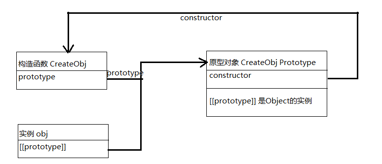

# 注意
- 传递函数 和 函数调用，传递的函数可以抽离，注意API传递的参数即可
- window.performance.now() 不受系统时间影响
- ()解释器先执行
- 严格模式为容易出错的地方，增加了限制


# script
## script元素有八个属性
- async：可选。表示应该立即开始下载脚本，但不能阻止其他页面动作，比如下载资源或等待其他脚本加载。只对外部脚本文件有效。
- charset：可选。使用src属性指定的代码字符集。这个属性很少使用，因为大多数浏览器不在乎它的值。
- crossorigin：可选。配置相关请求的CORS（跨源资源共享）设置。默认不使用CORS。crossorigin="anonymous"配置文件请求不必设置凭据标志。crossorigin="use-credentials"设置凭据标志，意味着出站请求会包含凭据。
- defer：可选。表示脚本可以延迟到文档完全被解析和显示之后再执行。只对外部脚本文件有效。在IE7及更早的版本中，对行内脚本也可以指定这个属性。
- integrity：可选。允许比对接收到的资源和指定的加密签名以验证子资源完整性（SRI, Subresource Integrity）。如果接收到的资源的签名与这个属性指定的签名不匹配，则页面会报错，脚本不会执行。这个属性可以用于确保内容分发网络（CDN, Content Delivery Network）不会提供恶意内容。
- language：废弃。最初用于表示代码块中的脚本语言（如"JavaScript"、"JavaScript 1.2"或"VBScript"）。大多数浏览器都会忽略这个属性，不应该再使用它。
- src：可选。表示包含要执行的代码的外部文件。
- type：可选。代替language，表示代码块中脚本语言的内容类型（也称MIME类型）。按照惯例，这个值始终都是"text/javascript"，尽管"text/javascript"和"text/ecmascript"都已经废弃了。JavaScript文件的MIME类型通常是"application/x-javascript"，不过给type属性这个值有可能导致脚本被忽略。在非IE的浏览器中有效的其他值还有"application/javascript"和"application/ecmascript"。如果这个值是module，则代码会被当成ES6模块，而且只有这时候代码中才能出现import和export关键字。

## 行内script
- 从上到下解释，并且保存在解释器环境中
- 代码被计算完成前，页面的其余内容不会被加载，也不会显示；
- 在使用行内JavaScript代码时，要注意代码中不能出现字符串<*/script>会报错，需要转义 <\/script>
- XHTML中编写规则更严格
    - 必须制定type且值为 text/javascript
    - XHTML 内部写法，不能出现小于号 会报错
        - 方法一，必须把小于号写成 #lt;
        - 方法二，注释抵消了非XHTML兼容浏览器中的问题，可以使用所有浏览器
        ```
        <script type="text/javascript">
        //<![CDATA[
            dosomething
        //]]>
        </script>
        ```

## 外部
- 多个地方用一个js文件，可缓存使用
- 在解释外部javascript文件的时候，页面也会阻塞，阻塞时间包括加载时间
- async 属性，可以立即下载脚本，但不阻塞其他页面执行， 多个 async，不能保证执行顺序，区别于defer
    - 只对外部有效
    - 给脚本添加async属性的目的是告诉浏览器，不必等脚本下载和执行完后再加载页面，同样也不必等到该异步脚本下载和执行后再加载其他脚本
- defer 立即下载，但延迟到文档完全解析和显示后再执行，规范要求多个defer要求按顺序执行
    - 不过在实际当中，推迟执行的脚本不一定总会按顺序执行或者在DOMContentLoaded事件之前执行，因此最好只包含一个这样的脚本。
    - 只对外部有效
- 其他按照页面书写顺序解释
- 在里面加行内代码会被忽略
- 在XHTML文档中，可以忽略结束标签
- src请求不一定可非要是js文件
- 浏览器解析资源会向src的路径发送一个URL请求，这个请求不受浏览器同源策略限制，但仍然受父页面HTTP/HTTPS协议的限制，返回并被执行的JavaScript则受限制。
- 在配置浏览器请求外部文件时，要重点考虑的一点是它们会占用多少带宽。在SPDY/HTTP2中，预请求的消耗已显著降低，以轻量、独立JavaScript组件形式向客户端送达脚本更具优势。浏览器支持 SPDY/HTTP2 ，就可以从同一个地方取一批文件，并逐个放到浏览器缓存
## noscript
- 以下两种会显示，noscript 标签中的内容，其他情况不会渲染其中的内容，noscript 标签中可包含其他标签，比如 p
    - 浏览器不支持脚本
    - 浏览器对脚本的支持被关闭
## 注意
- 需要动态加载的script外部脚本，比如在js中创建一个 script标签添加src属性。会影响性能，可以在文档头部， `<link rel="preload" href="想加载文件的路径">`
- 以前会把script放到head标签中，也就意味着必须把所有JavaScript代码都下载、解析和解释完成后，才能开始渲染页面（页面在浏览器解析到<*body>的起始标签时开始渲染）。
    - 对于需要很多JavaScript的页面，这会导致页面渲染的明显延迟，在此期间浏览器窗口完全空白
    - 为解决这个问题，现代Web应用程序通常将所有JavaScript引用放在<*body>元素中的页面内容后面
- 即使是字符串在 script 标签也不可以直接写， `</script>`，必须转义 **<\/script>** 才行
- 一个script标签为一个宏任务, 先执行第一个宏任务，也就是第一个script标签，然后依次去塞，先进先出
    - 执行顺序`同步代码执行结束 - 微任务执行结束 - 宏任务`    
    - [例子](../static/excuScript.html)
- 页面渲染时机
    1. 第一次，dom树和css树加载完毕
    2. 后面，在微任务执行结束, 去取宏任务的间隙
- 文档模式
    - 准标准模式通过过渡性文档类型（Transitional）和框架集文档类型（Frameset）来触发
    - 标准模式：一般指准标准模式 或 标准模式
---
---

# 语法基础
## 变量
- 第一个字符必须是字母/_/$
- 变量声明
 - var
    - 函数式作用域
    - 变量会成为 window 对象的属性
    - 同一作用域，重复定义不报错
    - 在函数中定义，外部不可访问
 - let
    - 块级作用域
    - 在解析代码时，Javascript引擎也会注意到块后面的 let/const 声明，在声明之前不可以引用，声明前使用的执行瞬间叫**暂时性死区**
    - 不会成为 window 对象的属性，let声明发生在全局作用域，相应变量会在**页面的生命周期续存**
    - 不可重复定义，不同script标签中的全局作用域也不行
    - 循环中使用，每次迭代循环中都会声明一个新的迭代变量，每次都引用不同的实例，并且不会溢出
        - for循环因为自增只能let
- const
    - 定义同时初始化
    - for-of和for-in，推荐const
- 注意
    - let/var混用重复声明会报错，不会受混用影响
    - 优先使用类型 const - let - var

## 数据类型：共七种类型
### typeof 操作数
- 操作数是操作符而不是函数，所以不需要参数，但可以传
- 使用
    ```
    let str = 'foo'
    typeof str
    typeof(str)
    ```
- 返回值为字符串
- **注意**
    - typeof null，返回值为 'object'， 因为*特殊值null认为是对空对象的引用*
    - typeof 函数，返回值为 'function'，可以用来区分函数和其他对象
    - 在Safari（直到Safari 5）和Chrome（直到Chrome 7）中用于检测正则表达式时，由于实现细节的原因，typeof也会返回"function"。目前是object
        - ECMA-262规定，任何实现内部[[Call]]方法的对象都应该在typeof检测时返回"function"。因为上述浏览器中的正则表达式实现了这个方法，所以typeof对正则表达式也返回"function"。
        - 在IE和Firefox中，typeof对正则表达式返回"object"。
### 基础类型1 - undefined
- 声明为初始化变量时，默认 undefined
- 一般，永远不用显式给某个变量设置 undefined
- 主要用于比较
- 对象空指针 和 未初始化变量的区别
- 由null派生而来
### 基础类型2 - Null
- 表示一个空对象指针
- 变量以后用来储存对象，建议用null初始化
### 基础类型3 - Boolean
- 转换其他值为布尔值 Boolean()，可以再任意类型数据上调用，且始终返回一个布尔值
- 空字符串，0，NaN, null, undefined会被转化为false，其他会被转化为true
### 基础类型4 - Number
- Number类型使用IEEE754格式表示整数和浮点值（在某些语言中也叫双精度值）。
- 不同的数值类型相应地也有不同的数值字面量格式。
    - 十进制，直接写
    - 八进制，0 + (0 - 7)
        - 如果超出有效范围，会忽略前面的零，当作十进制，如080
        - 八进制字面量在严格模式下是无效的，会导致JavaScript引擎抛出语法错误
        - 严格模式，要表示八进制使用 0o + (0 - 7)
    - 十六进制，0x(区分大小写) + (0 - 9A-F)(不区分大小写)
    > 使用八进制和十六进制格式创建的数值在所有*数学操作*中都被视为十进制数值
- **注意**
    - 由于JavaScript保存数值的方式，实际中可能存在正零（+0）和负零（-0）。正零和负零在所有情况下都被认为是等同的
- **浮点数**
    - 推荐写 0.1 而不是 .1
    - 存储浮点值使用的内存空间是存储整数值的两倍，所以ECMAScript总是想方设法把值转换为整数。如 1. 和 1.0 都会被转化为整数
    - 非常大或非常小的数值，浮点值可以用科学记数法来表示。
        - 3.125e7(3.125 * (10 ^ 7))
        - 将小数点后至少包含6个零的浮点值转换为科学记数法，如 3e-17(3 * (10 ^ -17))
    - 浮点值的精确度最高可达17位小数，但不如整数精确。如 0.1 + 0.3 = 0.30000000000000004(之所以存在这种舍入错误，是因为使用了IEEE 754数值，用这个的都有这个问题)，导致很难测试特定的浮点值。**因此永远不要测试某个特定的浮点值**。
    - 因内存限制，并不能表示所有数值。
        - Number.MIN_VALUE，最小值，在多数浏览器中是5e-324
        - Number.MAX_VALUE，最大值，在多数浏览器中是1.797693134862315 7e+308
    - 如果计算结果超过上述范围，任何无法表示的数值
        - 正数，Infinity(或者用 Number.NEGATIVE_INFINITY) 
        - 负数，-Infinity(或者用 Number.POSITIVE_INFINITY) 表示，
        - 超出后无法进行任何计算
    - **isFinite(num)** 判断是否有限大
- **NaN**，表示本来要返回数值的操作失败了（而不是抛出错误）
    - 在ECMAScript中，0、+0或-0相除会返回NaN，0/+0
    - 分子是非0值，分母是有符号0或无符号0，则会返回Infinity(5/0)或-Infinity(5/-0)
    - 任何涉及NaN的操作始终返回NaN
    - NaN不等于包括NaN在内的任何值，NaN == NaN, false
    - **isNaN(param)**，判断是否为一个数值，不是true
- **数值转换**，同一参数，三种方法执行的操作不同
    1. Number()，是转型函数，可用于任何数据类型，规则如下
        - 布尔值，true-1，false-1
        - 数值直接返回
        - null - 0
        - undefined - NaN
        - 字符串
            - 数值字符串，包括加减号，Number('-10') - -10 ， Number('1.1') - 1.1
            - 八进制 Number('011') - 11忽略前面的零， 正常转化Number('0o10') - 8
            - 将十六进制转化为十进制，Number('0xf') - 15
            - Number('') - 0
            - **除上述以外的字符串，即非数值字符串，均返回NaN**
        - 对象
            - 调用valueOf()方法，并按照上述规则转换返回的值。
            - 如果转换结果是NaN，则调用toString()方法，再按照转换字符串的规则转换
    2. parseInt()
        - 主要用于将字符串转换为数值
        - 通常想要得到整数优先用这个，更关注字符串是否包含数值模式
        - 从**第一个非空格字符串**开始转换
            - 如果第一个字符不是数值或者加减号立即返回NaN
                - 区别Number(), parseInt('')返回是NaN而不是0
            - 如果是数值或者加减号，则向后检测，到非数值（包括小数点，因为不是有效整数）字符串或者结束
        - 一个参数时
            - 以'0x'开头，将十六进制转化为十进制，如 parseInt('0xA') - 10
            - 以'0'开头，非严格模式，将八进制转化为十进制，如 parseInt('010') - 8
        - 二个参数，第二个参数用于指定底数（进制数），用于正确解析，如
            - parseInt('0xA') - 10
            - parseInt('A')为NaN, parseInt('A', 16) - 10
            - 扩展用法，可以把任意进制的字符串转化为十进制
                - parseInt('10', 2) // 2
                - parseInt('A', 12) // 10
            - 建议始终传第二个参数
    3. parseFloat()
        - 主要用于将字符串转换为数值
         - 从**第一个非空格字符串**开始转换
            - 如果第一个字符不是数值、加减号、或者小数点立即返回NaN
            - 如果是，解析到字符串末尾或者解析到一个无效的浮点数值字符为止
        - 区别于parseInt()，十六进制数值始终返回0。因为parseFloat()只解析十进制值，因此不能指定底数
        - 字符串表示整数（没有小数点或者小数点后面只有一个零），则返回整数
        - 始终忽略字符串开头的0
        ```
        let num1 = parseFloat("1234blue");   // 1234，按整数解析
        let num2 = parseFloat("0xA");         // 0
        let num3 = parseFloat("22.5");        // 22.5
        let num4 = parseFloat("22.34.5");    // 22.34
        let num5 = parseFloat("0908.5");     // 908.5
        let num6 = parseFloat("3.125e7");    // 31250000
        ```
### 基础类型5 - String
- 表示零或多个16位Unicode字符序列
- 可以用双引号（"）、单引号（'）或反引号（`）表示，使用哪种引号没有区别，开始结束一致即可
- 如果字符串中包含双字节字符，那么length属性返回的值可能不是准确的字符数
- **字符字面量**
    - 字符串包含一些字符字面量，用于表示非打印字符或有其他用途的字符，转义序列
        - \n 换行
        - \t 制表
        - \b 退格
        - \r 回车
        - \f 换页
        - \\\ 反斜杠
        - \'，\"，\\`  字符串使用引号
        - \xnn  以十六进制表示的字符，其中n（0-F），如 \x41 - A，此时**length为1**
        - \unnnn 以十六进制表示的Unicode字符，其中n（0-F），如 \u03a3 - Σ，此时**length为1**
    - 注意
        - 以上字符可以出现在字符串的任意位置
        - 当做单个字符解释，length 为 1
- 字符串的特点
    - ECMAScript中的字符串是不可变的（immutable），意思是一旦创建，它们的值就不能变了。
    - 要修改某个变量中的字符串值，必须**先销毁**原始的字符串，然后将包含新值的另一个字符串保存到该变量
    ```
    let lang = "Java";
    lang = lang + "Script";
    ```
    - 变量lang一开始包含字符串"Java"。
    - 紧接着，lang被重新定义为包含"Java"和"Script"的组合，也就是"JavaScript"。
    - 整个过程首先会分配一个足够容纳10个字符的空间，然后填充上"Java"和"Script"。
    - 最后销毁原始的字符串"Java"和字符串"Script"，因为这两个字符串都没有用了。
    - 所有处理都是在后台发生的，而这也是一些早期的浏览器（如Firefox 1.0之前的版本和IE6.0）在拼接字符串时非常慢的原因。
    - 这些浏览器在后来的版本中都有针对性地解决了这个问题。
- 字符串转换
    - xx.toString()
        - 返回当前值的字符串等价物
        - 字符串调用只是简单地返回自身的一个副本
        - null 和 undefined 没有toString()
        - 参数，一般不接受；数值调用可以接收一个底数参数，即以什么底数来输出数值的字符串表示，默认十
        ```
        let num = 10;
        num.toString()     // "10"
        num.toString(2))    // "1010"
        num.toString(8))    // "12"
        num.toString(10)    // "10"
        num.toString(16)    // "a"
        ```
    - String(xx)，始终会返回表示相应类型值的字符串，规则如下：
        - 如果值有toString()方法，则调用该方法（不传参数）并返回结果。
        - 如果值是null，返回"null"。
        - 如果值是undefined，返回"undefined"。
    - xx + '' 也可以隐式转换
- 模板字面量
    - 单双引号，引号内跨行会报错只能用\n，反斜杠可以直接跨行且被保留
    - 会保持内部空格，有时候可能看着格式不当，比如``中先换行的话，相当于加了一个/n
    - 字符串插值，也就是可以在一个连续定义中插入一个或多个值，严格来说模板字面量不是字符串，是一种特殊的js语法表达式，只不过求值后得到的是字符串。
        - 模板字面量在定义时立即求值并转换为字符串实例，任何插入的变量也会从它们最接近的作用域中取值。
        - 所有插入的值都会使用，所有插入的值都会使用toString()强制转型为字符串，而且任何JavaScript表达式都可以用于插值 \`${变量}str`

    - 标签函数，接收被插值记号分隔后的模板和对每个表达式求值的结果。
        - [例子](../static/tagFunction.js)
    - 原始字符串，对**直接使用转义字符**的字符串，注意本身就是一个换行符使用无效，如
        - String.raw\`\u00A9` -\u00A9
        - 但是 String.raw\`©` - ©
        - [例子](../static/rawStr.js)
### 基础类型6 - Symbol()
- 符号是原始值，且符号实例是唯一、不可变的。创建唯一标记，不会冲突
- 没有字面量语法，不能和 new 当做构造函数用，是为了避免创建符号包装对象，像使用Boolean、String或Number那样，它们都支持构造函数且可用于初始化包含原始值的包装对象
- 可以传入一个字符串参数作为对符号的描述（description），可以通过这个字符串来调试代码。但是，这个字符串参数与符号定义或标识完全无关
```
let genericSymbol = Symbol();
let otherGenericSymbol = Symbol();
let fooSymbol = Symbol('foo');
let otherFooSymbol = Symbol('foo');
console.log(genericSymbol == otherGenericSymbol); // false
console.log(fooSymbol == otherFooSymbol); // false
```
- 想要使用符号包装对象 Object(mySymbol)
- 全局符号注册表，需要复用时，使用字符串作为键
    ```
    let fooGlobalSymbol = Symbol.for('foo');
    let secondGlobalSymbol = Symbol.for('foo');
    console.log(typeof fooGlobalSymbol); // symbol
    fooGlobalSymbol === secondGlobalSymbol; // true
    ```
    - Symbol.for(str) 操作是幂等的，第一次调用的时候创建并注册到全局，后面继续调用相同的字符串时，直接返回该实例
    - Symbol('foo') !== Symbol.for('foo')
    - Symbol.for() **必须**使用字符串创建，传入的任何值都会被转化为字符串，不传值相当于 'undefined'
- Symbol.keyFor()来查询全局注册表
    - 接受符号，返回全局符号对应的字符串， Symbol.keyFor(Symbol.for('a')) - a
    - 如果不是全局符号返回 undefined， 如普通符号
    - 传入不是符号，抛错TypeError
- 作为对象属性
    - [例子](../static/objectSymbol.js)
    - 因为符号属性是对内存中符号的引用，如果没有找到只能Object.getOwnPropertySymbols(o)，循环tostring后，匹配字符串，才能找到
- 常用内置符号
    - 用于暴露语言内部行为，可以重新定义改变原生行为
    - 所有内置符号属性都是不可写、不可枚举、不可配置的。
    - 在提到ECMAScript规范时，经常会引用符号在规范中的名称，前缀为@@。比如，@@iterator指的就是Symbol.iterator。
    1. Symbol.asyncIterator
        - 方法，实现异步迭代器API的函数, 返回对象默认的AsyncIterator。for-await-of调用以Symbol.asyncIterator为键的函数。
        - 生成的对象应通过其next()方法陆续返回Promise实例。可以通过显式调用next()，也可隐式通过for-await-of调用
        - [例子](../static/symbolExams.js)
    2. Symbol.hasInstance
        - 方法，是否认可一个对象是它的实例。由instanceof操作符使用
        - 默认定义在原型上
        - [例子](../static/symbolExams.js)
    3. Symbol.isConcatSpreadable
        - 布尔值，true，可用Array.prototype.concat()打平其数组元素
        - Array.prototype.concat()方法会根据接收到的对象类型选择如何将一个类数组对象拼接成数组实例。
        - 数组对象默认情况下会被打平到已有的数组
            - false，整个对象追加到数组末尾。
            - 类数组对象，默认被追加到数组末尾，true打平。
            - 其他**不是类数组对象**的对象在Symbol.isConcatSpreadable被设置为true的情况下将被**忽略**。
            ```
            let initial = ['foo'];
            let array = ['bar'];
            console.log(array[Symbol.isConcatSpreadable]); // undefined
            console.log(initial.concat(array)); // ['foo', 'bar']
            // 类数组对象，默认直接追加 ['foo', {}]
            // 不是类数组对象，默认直接追加 ['foo', Set(1)]
            array[Symbol.isConcatSpreadable] = false;
            // 设置为true后
            // 类数组对象，直接追加 ['foo', 'bar']
            // 不是类数组对象，忽略 ['foo']
            initial.concat(array); //  ["foo", Array(1)]
            ```
    4. Symbol.iterator
        - 方法，返回对象默认的迭代器，表示实现迭代器API的函数。for-of语句使用。
        - 返回的对象是实现该API的Generator
        - [例子](../static/symbolExams.js)
    5. Symbol.match
        - 正则表达式方法，该方法用正则表达式去匹配字符串。String.prototype.match()方法使用
        - String.prototype.match()使用Symbol.match为键的函数，对正则表达式求值
        - 正则表达式的原型上默认有，因此所有正则表达式实例默认是这个String方法的有效参数
        - 非正则表达式值会被转换为RegExp对象。
        - 想改，直接使用参数，则可以重新定义Symbol.match函数以取代默认对正则表达式求值的行为，从而让match()方法使用非正则表达式实例。Symbol.match函数接收一个参数，就是调用match()方法的字符串实例
        - [例子](../static/symbolExams.js)
    6. Symbol.replace
        - 一个正则表达式方法，该方法替换一个字符串中匹配的子串。由String.prototype.replace()方法使用
        - String.prototype.replace()方法会使用以Symbol.replace为键的函数来对正则表达式求值。
        - 正则表达式的原型上默认有这个函数的定义，因此所有正则表达式实例默认是这个String方法的有效参数
        - 给这个方法传入非正则表达式值会导致该值被转换为RegExp对象。
        - 如果想改变这种行为，让方法直接使用参数，可以重新定义Symbol.replace函数以取代默认对正则表达式求值的行为，从而让replace()方法使用非正则表达式实例。
        - Symbol.replace函数接收两个参数，即调用replace()方法的字符串实例和替换字符串。
        - 返回的值没有限制
        - [例子](../static/symbolExams.js)
    8. Symbol.search
        - 一个正则表达式方法，该方法返回字符串中匹配正则表达式的索引。由String.prototype.search()方法使用
        - 默认有
        - 给这个方法传入非正则表达式值会导致该值被转换为RegExp对象。
        - 如果想改变这种行为，让方法直接使用参数，可以重新定义Symbol.search函数以取代默认对正则表达式求值的行为，从而让search()方法使用非正则表达式实例。
        - Symbol.search函数接收一个参数，就是调用match()方法的字符串实例。
        - 返回的值没有限制
        - [例子](../static/symbolExams.js)
    9. Symbol.species
        - 一个函数值，该函数作为创建派生对象的构造函数
        - 在内置类型中最常用，用于对内置类型实例方法的返回值暴露实例化派生对象的方法
        - 用Symbol.species定义静态的获取器（getter）方法，可以覆盖新创建实例的原型定义
        - [例子](../static/symbol.species.js)
    10. Symbol.split
        - 一个正则表达式方法，该方法在匹配正则表达式的索引位置拆分字符串。由String.prototype.split()方法使用。
        - String.prototype. split()方法会使用以Symbol.split为键的函数来对正则表达式求值。
        - 正则表达式的原型上默认有这个函数的定义，因此所有正则表达式实例默认是这个String方法的有效参数
        - 给这个方法传入非正则表达式值会导致该值被转换为RegExp对象。
        - 如果想改变这种行为，让方法直接使用参数，可以重新定义Symbol.split函数以取代默认对正则表达式求值的行为，从而让split()方法使用非正则表达式实例。
        - Symbol.split函数接收一个参数，就是调用match()方法的字符串实例
        - 返回的值没有限制
        - [例子](../static/symbolExams.js)
    11. Symbol.toPrimitive
        - 方法，将对象转换为相应的原始值。由ToPrimitive抽象操作使用
        - 很多内置操作都会尝试强制将对象转换为原始值，包括字符串、数值和未指定的原始类型
        - 自定义对象可以改
        - 根据提供给这个函数的参数（string、number或default，参数表示在做什么运算，字符串还是数值，还是其他），控制返回的原始值
        - [例子](../static/symbolExams.js)
    12. Symbol.toStringTag
        - 字符串，用于创建对象的默认字符串描述。Object.prototype.toString()调用
        - 内置的对象，默认为"Object"，会把内置对象的构造函数显示出来
        - [例子](../static/symbol.toStringTag.js)
    13. Symbol.unscopables
        - 对象，该对象所有及继承的属性，都会从关联对象的with环境绑定中排除
        - 设置并映射对应属性的键值为true，可以阻止属性出现在with环境绑定中
        - 不推荐使用with，因此也不推荐使用Symbol.unscopables
        ```
        let o = { foo: 'bar' };
        with(o) {
            console.log(foo); // bar
        }
        o[Symbol.unscopables] = {
            foo: true
        };
        with(o) {
            console.log(foo); // ReferenceError
        }
        ```

### 复杂数据类型 - Object
- 可以new Object()可以不加括号创建，但是不推荐
- 派生其他对象的基类，Object上有的属性和方法，派生对象也有
- 所有对象的基类，对象的行为不一定适合JavaScript其他对象，比如 BOM和DOM是宿主环境决定的，不受ECMA-262约束，所以可能不继承。
- 每个Object实例都有以下属性和方法：
    - constructor：用于创建当前对象的函数。在new Object()中，这个属性的值就是Object()函数。
    - hasOwnProperty（propertyName）：用于判断当前对象实例（不是原型）上是否存在给定的属性。要检查的属性名必须是字符串（如o.hasOwnProperty("name")）或符号。
    - isPrototypeOf（object）：用于判断当前对象是否为另一个对象的原型。
    - propertyIsEnumerable(propertyName)：用于判断给定的属性是否可以使用for-in语句枚举。属性名必须是字符串。
    - toLocaleString()：返回对象的字符串表示，该字符串反映对象所在的本地化执行环境。
    - toString()：返回对象的字符串表示。
    - valueOf()：返回对象对应的字符串、数值或布尔值表示。通常与toString()的返回值相同。

## 操作符
- 可以应用于各种值，不过在用给对象时，通常会调用valueOf()和/或toString()方法来取得可以计算的值。
### 递增/递减操作符
- 前缀递增或递减，会在语句被求值改变，俗称副作用
- 前缀递增或递减 和 后缀递增或递减，可以作用于任何值，不限于整数——字符串、布尔值、浮点值，对象也可，最终都会转化为数值（数值包括NaN）。规则如下
    - 有效数值字符串，转为数值，再计算
    - 非有效数值字符串，NaN
    - 布尔值false，0，再计算
    - 布尔值true，1，再计算
    - 浮点数，加减1，浮点数会不精确，如let a = 1.1; --a; 0.10000000000000009
    - 对象，先valueOf()，应用上面规则，仍NaN的话；则再toString()，应用上面规则，不行，NaN
### 一元加和减操作符
- 主要用于数值运算，也可用于转类型
- 加号
    - 对数值没有任何影响
    - 应用到非数值，和Number一样的规则，最终都会变为数值
- 减号
    - 数值变负数
    - 应用到非数值，和加号一样，转化后取负值
### 位操作符
- 用于数值的底层操作，即操作内存中表示数据的比特（位）
- ECMAScript中的所有数值都以IEEE 754 64位格式存储。位操作并不直接用64位，先转成32位，再运算，再转成64位存储，但开发者只感知到32位。这个转换也导致副作用，即特殊值NaN和Infinity在位操作中都会被当成0处理
- 有**符号整数**使用32位 = 前31位表示整数值 + 第32位表示数值的符号（0表示正，1表示负）。第32位称为符号位（sign bit），它的值决定了数值其余部分的格式
    - 正值以真正的二进制格式存储，即31位中的每一位都代表2的幂，第一位2的0次方，依次类推，空用0填，表示忽略不计。如数值18的二进制格式为00000000000000000000000000010010，或更精简的10010。后者是用到的5个有效位，决定了实际的值，2^4 + 2^1 = 18
    - 负值以一种称为二补数（或补码）的二进制编码存储，计算：
        1. 确定绝对值的二进制表示，比如 -18 看 18
        2. 找到数值的一补数（或反码），即，每个0变1，每个1变0，比如  10010 变   1111   1111   1111   1111   1111   1111   1110   1101
        3. 给结果加一， 1111   1111   1111   1111   1111   1111   1110   1110
    - 在处理有符号整数时，无法访问第31位。
    - ECMAScript会记录，转换时会求补位，但实际看到的-18.toString(2)为-10010，绝对值加负号
    - ECMAScript所有整数都是有符号数的，但实际也有无符号的，第32不表示符号表数值，此时表示整数范围更大
#### 位非操作符 波浪符（~）
- 返回数值的一补数
```
let num1 = 25;        // 二进制00000000000000000000000000011001
let num2 = ~num1;    // 二进制11111111111111111111111111100110
console.log(num2);   // -26
```
- 按位非的最终效果是对数值取反并减1，但因为位操作是在数值的底层表示上完成的，位操作的速度快得多。

#### 按位与操作符 和号（&）
- 两个操作数，a&b，返回值会将二进制转为十进制数
- 都是1返回1，遇0则0

#### 按位或操作符 管道符（|）
- 两个操作数，a|b，返回值会将二进制转为十进制数
- 都是0返回0，遇1则1

#### 按位异或 脱字符（^）
- 两个操作数，a^b，返回值会将二进制转为十进制数
- 一0一1，返回1；一样0

#### 左移，两个小于号（<<）
- 会按照指定的位数将数值的所有位向左移动
- 转为二进制，**符号位固定不变**，将其他精简，向左移动几位，后面补几个零
- 负数时，转化为绝对值，左移后，加负号
- 左移保留操作数的符号。 2 << 5 - 64, -2 << 5 - -64

#### 右移
1. 有符号右移
    - 两个大于号（>>）
    - 是左移的逆运算
    - 转二进制，将其他精简，向右移动几位，空位出现在左侧，**符号位之后**，补几个零
    - 负数时，转化为绝对值，右移后，加负号
2. 无符号右移
    - 3个大于号（>>>）
    - 将数值的所有32位都向右移
    - 正数和有符号右移一样
    - 负数，连带符号位一起左移
### 布尔操作符
1. 逻辑非 叹号（!），一个操作数
    - 始终返回布尔值
    - 先将操作数转换为布尔值，再取反
    - 非0数值（包括Infinity），false
    - NaN、null，true
    - 两个叹号（! !），相当于调用Boolean()
2. 逻辑与 两个和号（&&），两个个操作数
    - 有操作数不是布尔值，不一定返回布尔值，规则如下
        - 第一个对象，则返回第二个操作数。
        - 第二个对象，则只有第一个操作数求值为true才会返回该对象。
        - 两个都对象，则返回第二个操作数。
        - 有一个null，则返回null。
        - 有一个NaN，则返回NaN。
        - 有一个操作数是undefined，则返回undefined
    - 短路操作符，如果第一个值决定了结果false，不会再对第二个操作数求值
3. 逻辑或 两个管道符（||）
    -  有操作数不是布尔值，不一定返回布尔值，规则如下
        - 第一个是对象，则返回第一个操作数。
        - 第一个求值为false，则返回第二个操作数。
        - 两个都是对象，则返回第一个操作数。
        - 两个都是null，则返回null。
        - 两个都是NaN，则返回NaN。
        - 两个都是undefined，则返回undefined。
    - 短路操作符，如果第一个值决定了结果true，不会再对第二个操作数求值
        - 可用于赋值默认值
### 乘性操作符
1. 乘法 *
    - 非数值操作数，会使用Number转型
    - 有NaN返回NaN
    - 0 * Infinity，NaN
2. 除法 /
    - 非数值操作数，会使用Number转型
    - 有NaN返回NaN
    - Infinity / Infinity、0 / 0 ，NaN
    - 非0 / 0，Infinity；负非0 / 0，-Infinity
3. 取模操作数 %，返回余数
    - 非数值操作数，会使用Number转型
    - Infinity % 有限值，NaN
    - 有限值 % Infinity，有限值
    - 有限值 % 0，NaN
    - Infinity % Infinity，NaN
    - 0 % 非，0
### 指性操作符
- Math.pow(3, 2) === 3 ** 2 = 9
- 指数赋值操作符 let a = 3; a **= 2，9
### 加性操作符
1. 加法 + 
    - 都是数值，规则如下：
        - 如果有任一操作数是NaN，则返回NaN；
        - 如果是Infinity加Infinity，则返回Infinity；
        - 如果是-Infinity加-Infinity，则返回-Infinity；
        - 如果是Infinity加-Infinity，则返回NaN；
        - 如果是+0加+0，则返回+0；
        - 如果是-0加+0，则返回+0；
        - 如果是-0加-0，则返回-0
    - 有一个字符串，拼接，对象调用toString()\undefined、null掉调用String()
2. 减法 -
    - 两个操作数都是数值，执行数学减法运算并返回结果。
    - 有任一操作数是NaN，则返回NaN。
    - Infinity减Infinity，则返回NaN。
    - -Infinity减-Infinity，则返回NaN。
    - Infinity减-Infinity，则返回Infinity。
    - -Infinity减Infinity，则返回-Infinity。
    - +0减+0，则返回+0。
    - +0减-0，则返回-0。
    - -0减-0，则返回+0。
    - 有任一操作数是字符串、布尔值、null或undefined，则Number()转换，再用前面的规则执行数学运算。如果转换结果是NaN，则减法计算的结果是NaN。
    - 有任一操作数是对象，valueOf()。如果是NaN，则减法计算的结果是NaN。如果对象没有valueOf()方法，则调用其toString()方法，然后再将得到的字符串转换为数值。
### 关系操作符 < <= > >=
- 均返回布尔值
- 规则
    - 都是数值，数值比较。
    - 都是字符串，则逐个比较字符串中对应**字符的编码**。
    - **任一操作数是数值**，则将另一个操作数转换为数值，执行数值比较
    - 任一操作数是对象，调用valueOf()后，根据前面的规则执行比较。如果没有valueOf()，则用toString()后比较。
    - 任一操作数是布尔值，则将其转换为数值再执行比较
    - 任何关系操作符在涉及比较NaN时都返回false
- 大写字母的编码都小于小写字母的编码，最好转成小写比较
- '23' < '3'，true，字符串; '23' < 3，false，数值
### 相等操作符
- 等于和不等于会进行强制类型转化
    - 布尔转数值
    - 一字符串一数值，转成数值
    - 对象，valueOf()后比较
    - null == undefined
    - null和undefined不能转为其他类型的值再比较
    - NaN与任何不相等
    - 指向同一对象相等，否则不
### 赋值操作符 %= 、<<= 、>>=
### 逗号操作符
- let num = (5, 1, 4, 8, 0); // num的值为0，返回表达式最后一个值

## 语句，流控制
- do-while 后测试语句，至少执行一次
- for循环
    - 初始化，条件表达式，循环后表达式都不是必须的
        - for(;;){} 无限循环
    - 第三个，循环后执行后执行的表达式，一般是 i++，循环体执行了才会执行；
- for-in： key
    - 枚举对象中**非符号键**属性
    - 循环遍历为null，undefined不执行循环体
- for-of: value
    - 遍历可迭代对象，如果不可迭代，会抛错
- for-await-of
    ```
    async function* asyncGenerator() {
        let i = 0;
        while (i < 3) {
            yield i++;
        }
    }

    (async function() {
        for await (let num of asyncGenerator()) {
            console.log(num);
        }
    })();
    // 0
    // 1
    // 2
    ```
- 标签语句 label: statement
    - 可通过break或continue语句引用
        - break直接跳出到标签位置
        - continue 直接跳回标签位置
    ```
    start: for (let i = 0; i < count; i++) {
        console.log(i);
    }
    ```
- with(expression) statement; 
    - 将代码作用域设置为特定对象
    - 针对对一个对象反复操作的场景
    - statement先找局部变量，在搜索expression下同名属性
    - 严格模式不可用
    ```
    with(location) {
        let qs = search.substring(1);
        let hostName = hostname;
        let url = href;
    }
    ```
- switch
    - break会跳出switch，不写 break 会继续匹配下一个条件，这时，最好加个注释，表示故意不写
    - value1可以是变量或表达式求值
    - 默认是对比 expression 和 value1，全等判断
    - expression为布尔值true时，下面的case可以写其他表达式求值为true时，执行语句

    ```
    switch (expression) {
        case value1:
            statement
            break;
        case value2:
            statement
            break;
        default:
        statement
    }
    ```
- 函数
    - 严格模式，函数名或者参数不能是eval或者arguments，两个参数不可同名，否则会报错，不执行

# 变量、作用域与内存
## 原始值和引用值
- 原始值： 六种原始值是按值引用的，不能有属性，但添加不会报错。原始值大小固定，因此保存在栈内存上
- 引用值，保存在内存中，不允许直接访问内存位置，因此不能直接操作对象的内存空间。实际上操作的是引用（指向对应对象的指针），按引用访问；引用值是对象，存储在堆内存上。
- 函数传参是按值传参的会复制，所以如果传参对象，函数内部的修改会反应到外部
- 传参是会复制到一个局部变量（即一个命名参数），或者说复制到arguments一个槽位中
- typeof只能区分原始值，引用至用 variable instanceof constructor(如Array)
### 执行上下文
#### 基础
- 变量或函数的上下文决定了它们可以访问哪些数据，以及它们的行为。
- 每个上下文都有一个关联的**变量对象**（variable object），而这个上下文中定义的所有变量和函数都存在于这个对象上。
- 虽然无法通过代码访问变量对象，但后台处理数据会用到它。
- 上下文在其所有代码都执行完毕后会被销毁，包括定义在它上面的所有变量和函数。
- 全局上下文
    - 最外层的上下文
    - 根据ECMAScript实现的宿主环境，表示全局上下文的对象可能不一样
    - 在浏览器中，就是window对象，因此var定义的全局变量和函数都会成为window对象的属性和方法。
    - 使用let和const的顶级声明不会定义在全局上下文中，但在作用域链解析上效果是一样的。
    - 全局上下文在应用程序退出前才会被销毁，比如关闭网页或退出浏览器
- 函数上下文
    - 每个函数调用都有自己的上下文。
    - 当代码执行流进入函数时，函数的上下文被推到一个**上下文栈**上。
    - 在函数执行完之后，上下文栈会弹出该函数上下文，将控制权返**还给之前的执行上下文**。
    - ECMAScript程序的执行流就是通过这个上下文栈进行控制的。
- 执行上下文分全局上下文、函数上下文和块级上下文
- 变量的执行上下文用于确定什么时候释放内存
- **作用域链**
    - 上下文中的代码在执行的时候，会创建变量对象的一个**作用域链**（scopechain）。
    - 决定了各级上下文中的代码在访问变量和函数时的顺序。
    - 代码正在执行的上下文的变量对象始终位于作用域链的最前端。
    - 如果上下文是函数，则其**活动对象**（activation object）用作变量对象。
    - 活动对象最初**只有一个**定义变量：arguments。（全局上下文中没有这个变量。）
    - 作用域链中的下一个变量对象来自包含上下文，再下一个对象来自再下一个包含上下文。以此类推直至全局上下文；
    - 全局上下文的变量对象始终是作用域链的最后一个变量对象。
    - 代码执行时的标识符解析是通过沿作用域链逐级搜索标识符名称完成的。搜索过程始终从作用域链的最前端开始，然后逐级往后，直到找到标识符。（如果没有找到标识符，那么通常会报错。）
    - 局部作用域中定义的变量可用于遮蔽全局变量
    - 内部上下文可以通过作用域链访问外部上下文中的一切，但外部上下文无法访问内部上下文中的任何东西。上下文之间的连接是线性的、有序的。可以向上找，不可向下。
#### 作用域链增强
- 执行上下文主要有全局上下文和函数上下文。eval()内部存在第三种上下文，可在其他方式来增强作用域链
- 某些语句会导致在作用域链前端**临时添加**一个上下文，这个上下文在代码执行后会被删除。通常以下两种情况会出现：
    1. try/catch语句的catch块，创建一个新的变量对象，包含要抛出的错误对象的声明
    2. with语句，添加指定对象
#### 变量声明
1. var
    - 被添加在最接近的上下文，函数/全局
    - 未声明初始化，添加到全局上下文，严格模式报错
    - 声明会提升（undefined 而不是 Reference Error），可先赋值，再声明
2. const 
    - 声明不初始化会报错
    - 只应用到顶级原语或者对象，不可赋值其他引用值，但对象的键则不受限制
    - 想让整个对象都不能修改，可以使用Object.freeze()，再给属性赋值时不会报错，但会静默失败
    - 由于const声明暗示变量的值是单一类型且不可修改，JavaScript运行时编译器可以将其所有实例都替换成实际的值，而**不会通过**查询表进行变量查找。谷歌的V8引擎就执行这种优化。
#### 标识符查找
- 当在特定上下文中为读取或写入而引用一个标识符时，必须通过搜索确定这个标识符表示什么。
    - 搜索开始于作用域链前端，以给定的名称搜索对应的标识符。
    - 如果在局部上下文中找到该标识符，则搜索停止，变量确定；
    - 如果没有找到变量名，则继续沿作用域链搜索。（注意，作用域链中的对象也有一个原型链，因此搜索可能涉及每个对象的原型链。）
    - 这个过程一直持续到搜索至全局上下文的变量对象。
    - 如果仍然没有找到标识符，则说明其未声明。
- 使用块级作用域声明并不会改变搜索流程，但可以给词法层级添加额外的层次
- 局部找到后不会找到全局，除非用 window.xx
- 标识符查找有代价。访问局部变量比访问全局变量要快，因为不用切换作用域。不过，JavaScript引擎在优化标识符查找上做了很多工作，将来这个差异可能就微不足道了。

### 垃圾回收
- JavaScript是使用垃圾回收的语言，也就是说执行环境负责在代码执行时管理内存。
- 自动内存管理实现内存分配和闲置资源回收
- 周期性检查不使用的变量，**周期性**（或者说在代码执行过程中某个预定的收集时间）就会自动运行
- 垃圾回收过程是一个近似且不完美的方案，因为某块内存是否还有用，属于“不可判定的”问题，意味着靠算法是解决不了的。
#### 用过的两种主要标记策略
1. 标记清理（mark-and-sweep）
    - 当变量进入上下文，会被加上存在于上下文中的标记。当变量离开上下文时，也会被加上离开上下文的标记。
    - 离开作用域的值会被自动标记为可回收，然后在垃圾回收期间被删除
    - 加标记的方式有很多种。比如，当变量进入上下文时，反转某一位；或者可以维护“在上下文中”和“不在上下文中”两个变量列表，可以把变量从一个列表转移到另一个列表。标记过程的实现并不重要，关键是策略
    - 垃圾回收程序运行的时候，会标记内存中存储的所有变量（**记住，标记方法有很多种**）。它会将所有在上下文中的变量，以及被在上下文中的变量引用的变量的标记**去掉**。在此之后再被加上标记的变量就是待删除的了，原因是任何在上下文中的变量都访问不到它们了。随后垃圾回收程序做一次内存清理，销毁带标记的所有值并收回它们的内存。
    - 到了2008年，IE、Firefox、Opera、Chrome和Safari都在自己的JavaScript实现中采用标记清理（或其变体），只是在运行垃圾回收的频率上有所差异。
2. 引用计数，不再使用
    - 对每个值都记录它被引用的次数
    - 当一个值的引用数为0时，就说明没办法再访问到这个值了，因此可以安全地收回其内存了。垃圾回收程序**下次运行**的时候就会释放引用数为0的值的内存。
    - 问题点在于循环引用 let a = {}; let b = {}; a.obj = b; b.obj = a; 引用数为2
    - 在IE8及更早版本的IE中，并非所有对象都是原生JavaScript对象。BOM和DOM中的对象是C++实现的组件对象模型（COM, Component Object Model）对象，而**COM对象**使用引用计数实现垃圾回收。
    - 即使这些版本IE的JavaScript引擎使用标记清理，JavaScript存取的COM对象依旧使用引用计数。换句话说，只要涉及COM对象，就无法避开循环引用问题
    - 为避免类似的循环引用问题，应该在确保不使用的情况下切断原生JavaScript对象与DOM元素之间的连接。手动删除引用赋值null


#### 性能
- 垃圾回收程序会周期性运行，如果内存中分配了很多变量，则可能造成性能损失，因此垃圾回收的时间调度很重要。尤其是在内存有限的**移动设备上**，垃圾回收**有可能会明显拖慢渲染的速度和帧速率**。开发者不知道什么时候运行时会收集垃圾，因此最好的办法是在写代码时就要做到：无论什么时候开始收集垃圾，都能让它尽快结束工作。
- 现代垃圾回收程序会基于对JavaScript运行时环境的探测来决定何时运行。探测机制因引擎而异，但基本上都是根据已分配对象的大小和数量来判断的。比如，根据V8团队2016年的一篇博文的说法：“在一次完整的垃圾回收之后，V8的堆增长策略会根据活跃对象的数量外加一些余量来确定何时再次垃圾回收。”
- 由于调度垃圾回收程序方面的问题会导致性能下降，曾经IE是根据分配数，只要超过分配数，就会垃圾回收。但是可能整个周期中一直需要，结果就会导致垃圾回收程序过于频繁地运行。由于对性能的严重影响，IE7最终更新了垃圾回收程序。 IE7发布后，JavaScript引擎的垃圾回收程序被调优为动态改变分配变量、字面量或数组槽位等会触发垃圾回收的阈值。IE7的起始阈值都与IE6的相同。如果垃圾回收程序回收的内存不到已分配的15%，这些变量、字面量或数组槽位的阈值就会翻倍。如果有一次回收的内存达到已分配的85%，则阈值重置为默认值。这么一个简单的修改，极大地提升了重度依赖JavaScript的网页在浏览器中的性能。
- 在某些浏览器中是有可能（但不推荐）主动触发垃圾回收的。在IE中，window. CollectGarbage()方法会立即触发垃圾回收。在Opera 7及更高版本中，调用window. opera.collect()也会启动垃圾回收程序。

#### 内存管理
- JavaScript运行在一个内存管理与垃圾回收都很特殊的环境。分配给浏览器的内存通常比分配给桌面软件的要少很多，分配给移动浏览器的就更少了。这更多出于安全考虑而不是别的，就是为了避免运行大量JavaScript的网页耗尽系统内存而导致操作系统崩溃。这个内存限制不仅影响变量分配，也影响调用栈以及能够同时在一个线程中执行的语句数量。
- 将内存占用量保持在一个较小的值可以让页面性能更好。优化内存占用的最佳手段就是保证在执行代码时只保存必要的数据。如果数据不再必要，那么把它设置为null，从而释放其引用（对于对象，解除引用如果属性引用了其他对象，也需要设置成null）。这也可以叫作**解除引用**。这个建议最适合全局变量和全局对象的属性。局部变量在超出作用域后会被自动解除引用。可以消除循环引用，而且对垃圾回收也有帮助。
- 函数变量赋值了一个新对象，退出时，只要没有递归或者闭包，也会解除引用。
- 解除对一个值的引用并不会自动导致相关内存被回收。解除引用的关键在于确保相关的值已经不在上下文里了，因此它在下次垃圾回收时会被回收。
1. 通过const和let声明提升性能，因为块级作用域
2. 隐藏类和删除操作
    - 根据JavaScript所在的运行环境，有时候需要根据浏览器使用的JavaScript引擎来采取不同的性能优化策略。截至2017年，Chrome使用V8JavaScript引擎。V8在将解释后的JavaScript代码编译为实际的机器码时会利用“隐藏类”。
    - 运行期间，V8会将创建的对象与隐藏类关联起来，以跟踪它们的属性特征。能够共享相同隐藏类的对象性能会更好，V8会针对这种情况进行优化，但不一定总能够做到。
    - 如果共享的隐藏对象的两个变量，其中一个添加了值或者删除了某个属性（会导致生成相同的隐藏类片段），那么就不能共享，会变成两个隐藏类。频率多或者隐藏对象明显影响性能
    - 最佳实践是把不想要的属性设置为null。这样可以保持隐藏类不变和继续共享，同时也能达到删除引用值供垃圾回收程序回收的效果。
    ```
    function Article() {
        this.title = 'Inauguration Ceremony Features Kazoo Band';
        this.author = 'Jake';
    }
    let a1 = new Article();
    let a2 = new Article();
    a1.author = null;
    ```
3. 内存泄漏
    - 变量赋值前，没有使用声明关键字
    - 定时器回调函数通过闭包使用外部变量
    - 函数闭包
4. 静态分配与对象池
    - 为了提升JavaScript性能，最后要考虑的一点往往就是压榨浏览器了。一个关键问题就是如何减少浏览器执行垃圾回收的次数。开发者无法直接控制什么时候开始收集垃圾，但可以间接控制触发垃圾回收的条件。理论上，如果能够合理使用分配的内存，同时避免多余的垃圾回收，那就可以保住因释放内存而损失的性能。
    - 浏览器决定何时运行垃圾回收程序的一个标准就是对象更替的速度。如果有很多对象被初始化，然后一下子又都超出了作用域，那么浏览器就会采用更激进的方式调度垃圾回收程序运行，这样当然会影响性能。
    - 频繁创建新对象（初始化对象），垃圾回收调度程序会发现这里对象更替的速度很快，从而会更频繁地安排垃圾回收。
    - 一个策略是使用对象池。在初始化的某一时刻，可以创建一个对象池，用来管理一组可回收的对象。后续只变属性。由于没发生对象初始化，垃圾回收探测就不会发现有对象更替，因此垃圾回收程序就不会那么频繁地运行
    - 如果对象池只按需分配矢量（在对象不存在时创建新的，在对象存在时则复用存在的），那么这个实现本质上是一种贪婪算法，有单调增长但为静态的内存。这个对象池必须使用某种结构维护所有对象，数组是比较好的选择。不过，使用数组来实现，必须留意不要招致额外的垃圾回收。
    - 比如`let objList = new Array(100)；let obj = {}; objList.push(obj)`由于JavaScript数组的大小是动态可变的，引擎会删除大小为100的数组，再创建一个新的大小为200的数组。垃圾回收程序会看到这个删除操作，说不定因此很快就会跑来收一次垃圾。要避免这种动态分配操作，可以在初始化时就创建一个大小够用的数组，从而避免上述先删除再创建的操作。不过，必须事先想好这个数组有多大。
    - 注意 静态分配是优化的一种极端形式。如果你的应用程序被垃圾回收严重地拖了后腿，可以利用它提升性能。但这种情况并不多见。大多数情况下，这都属于过早优化，因此不用考虑。
---
---

# 基本引用类型 
- 类 ≠ 引用类型
## new Date()
- 不传值，当前时间；
- 其他时间，必须传入其毫秒表示（UNIX纪元1970年1月1日午夜之后的毫秒数）
- **Date.parse()**
    - 参数日期字符串，返回毫秒数
        - 参数不可省略年月日，时分秒可以
        - 不提供从最初的开始
        - 月是从零起点
        - 可隐式调用
            ```
            let someDate = new Date(Date.parse("May 23, 2019"));
            // 等价，默认会在后台调用Date.parse() 
            let someDate = new Date("May 23, 2019");
            ```
    - 不是日期会返回NaN       
- **Date.UTC()**
    - 参数的数字，返回毫秒数
        - 参数不可省略年月，日时分秒可以
        - Date.UTC(2000,0,1,0,0,0)
        - 24小时制
        - 可隐式调用
            ```
            let allFives = new Date(Date.UTC(2005, 4, 5, 17, 55, 55));
            // 等价
            let allFives = new Date(2005, 4, 5, 17, 55, 55);
            ```
- **Date.now()** 返回当前本地时间毫秒数
- 继承的方法
    - 与其他类型一样，重写了toLocaleString()、toString()和valueOf()方法。不一样的是，重写后方法的返回值不一样
    - **.toLocaleString()**
        - 返回与浏览器运行的本地环境一致的日期和时间。格式中包含AM（上午）或PM（下午），但不包含时区信息`new Date().toLocaleString() "2022/1/24 下午10:11:55"`
    - **.toString()**
        - 返回带时区信息的日期和时间，而时间24小时制（0~23）`new Date().toString() "Mon Jan 24 2022 22:13:49 GMT+0800 (中国标准时间)"`
    > 以上两个方法返回格式可能因浏览器而不同，所以最好不要用于显示
    - **.valueOf()**
        - 不返回字符串，返回毫秒数
- 日期格式化 返回字符串
    - .toDateString()，显示日期中的周几、月、日、年（格式特定于实现） - "Mon Jan 24 2022"
    - .toTimeString()，显示日期中的时、分、秒和时区（格式特定于实现）- "22:24:06 GMT+0800 (中国标准时间)"
    - .toLocaleDateString()，显示日期中的周几、月、日、年（格式特定于实现和地区） - "2022/1/24"
    - .toLocaleTimeString()，显示日期中的时、分、秒（格式特定于实现和地区）- "下午10:24:55"
    - .toUTCString()，显示完整的UTC日期（格式特定于实现） - "Mon, 24 Jan 2022 14:25:12 GMT"
    - .toGMTString()，同上
    > 因浏览器而异，以上不能用于在用户界面上一致地显示日期
- 日期时间
    - “UTC日期”，指的是没有时区偏移（将日期转换为GMT）时的日期
    - .getTime() 和 .valueOf()返回毫秒数
    - .setTime(num) 修改时间
    - .getMonth() + .setMonth() 设置日期中的月(0~11，大于该年月，年+1)
    - .getDate() + .setDate() 设置日期中的日(1~31，大于该月天，月+1)
    - .getDay (0~6，周几，唯一一个只有获取没有设置)
    - 其他均有，年（只能四位）月日，时分秒，甚至毫秒的获取和设置方法，包括UTC的
    - .getTimezoneOffset() 返回以分钟计的UTC与本地时区的偏移量（这个值一年中不是固定不变的）
## new RegExp()
- 匹配模式的标记
     - g：全局模式
     - i：忽略大小写
     - m：多行模式，表示查找到一行文本末尾时会继续查找。
     - y：粘附模式，表示只查找从lastIndex开始及之后的字符串
     - u: Unicode模式，启用Unicode匹配。
     - s:dotAll模式，表示元字符．匹配任何字符（包括\n或\r）
- 元字符 ( [ { \ ^ $ | ) ] } ? ＊ + . 需要转义
### 两种声明方式
1. 字面量`/[bc]at/i`
2. 构造函数new RegExp(模式字符串, 标记字符串(可选)) `new RegExp("[bc]at", "i");`
    - 模式字符串是字符串，有时候需要二次转义
    ```
    /\.at/  --  \\.at
    /\d.\d{1,2}/ -- \\d.\\d{1,2}
    ```
    - 可以字面量生成后，作为构造函数的第一个参数，修改标记，生成一个新的正则
### 实例
- 实例属性
    ```
    let pattern1 = /\[bc\]at/i;
    // 布尔值，是否全局搜索
    console.log(pattern1.global); // false
    // 布尔值，是否忽略大小写
    console.log(pattern1.ignoreCase); // true
    // 布尔值，是否启用Unicode匹配
    console.log(pattern1.unicode); // false
    // 布尔值，是否粘附模式
    console.log(pattern1.sticky); // false
    // 整数，表示下一次搜索的开始位置，始终从0开始
    console.log(pattern1.lastIndex); // 0
    // 布尔值，是否多行模式
    console.log(pattern1.multiline); // false
    // 布尔值，是否:dotAll模式，表示元字符．匹配任何字符（包括\n或\r）
    console.log(pattern1.dotAll); // false
    // 字符串，字面量字符串，没有前后斜杠
    console.log(pattern1.source); // "\[bc\]at"
    // 标记字符串
    console.log(pattern1.flags); // "i"
    ```
- 实例方法
    1. .exec(字符串) 配合捕获组使用
        - 匹配，返回包含第一个匹配信息的数组
            - 数组包括，index 0 是字符串中匹配模式的起始位置，input是要查找的字符串
            - 第一个元素是匹配整个模式的字符串，其他为捕获组的字符串，没有捕获组数组只有一项
            - 没有设置全局属性，操作幂等，每次返回第一个匹配的信息；有，则每次向前搜索，数组.index和实例.lastIndex会变，直到末尾
            - 设置了粘附标记y，则每次调用exec()就只会在lastIndex的位置上寻找匹配项。**粘附标记覆盖全局标记。**
                ```
                let text = "cat, bat, sat, fat";
                let pattern = /.at/y;
                let matches = pattern.exec(text);
                console.log(matches.index); // 0
                console.log(matches[0]); // cat
                console.log(pattern.lastIndex); // 3
                // 以索引3 对应的字符开头找不到匹配项，因此exec()返回null
                // exec()没找到匹配项，于是将lastIndex设置为0
                matches = pattern.exec(text);
                console.log(matches); // null
                console.log(pattern.lastIndex); // 0
                // 向前设置lastIndex可以让粘附的模式通过exec()找到下一个匹配项：
                pattern.lastIndex = 5;
                matches = pattern.exec(text);
                console.log(matches.index); // 5
                console.log(pattern.lastIndex); // 8
                ```
        - 不匹配，返回null
    2. .test(字符串) 只关心是否匹配，不关注实际匹配内容（为啥不匹配）
    3. .toString() 正则表达式的字面量字符串
    4. .toLocaleString() 正则表达式的字面量字符串
    5. valueOf() 正则表达式字面量
### RegExp构造函数
- 构造函数本身静态属性，根据**最后执行**的正则表达式操作而变化，没有标准，不建议直接使用
- 可提取出与exec()和test()执行的操作相关的信息
    ```
    let text = "this has been a short summer";
    let pattern = /(.)hort/g;
    // 注意：Opera不支持简写属性名
    // IE不支持多行匹配
    if (pattern.test(text)) {
        // 原始字符串
        RegExp.$_ === RegExp.input; // this has been a short summer
        // 匹配之前的内容
        RegExp['$`'] === RegExp.leftContext; // this has been a
        // 匹配之后的内容
        RegExp["$'"] === RegExp.rightContext; // summer
        // 匹配整个正则表达式的字符串
        RegExp['$&'] === RegExp.lastMatch; // short
        // 捕获组
        RegExp['$+'] === RegExp.lastParen; // s
    }
    ```
- RegExp.$1~RegExp.$9，存储最多9个捕获组的匹配项
## 原始值类型
- 不同于其他引用类型，每当用到某个原始值的方法或属性时，后台都会创建一个相应原始包装类型的对象，从而暴露出操作原始值的各种方法
- 创建相应原始值后，后续以读模式访问，这时候后台都会执行以下3步：
    1. 创建一个String类型的实例；
    2. 调用实例上的特定方法；
    3. 销毁实例。
- 生命周期，引用类型与原始值包装类型的主要区别在于对象的生命周期。
    - 在通过new实例化引用类型后，得到的实例会在离开作用域时被销毁
    - 自动创建的**原始值包装对象**则只存在于访问它的**那行代码执行期间**。
- Object构造函数，能够根据传入值的类型返回相应原始值包装类型的实例，布尔值，数值一样
    ```
    let obj = new Object("some text");
    console.log(obj instanceof String);   // true
    ```
- 使用new调用原始值包装类型的构造函数，与调用同名的转型函数并不一样
- **以下三种类型中的方法，均可以创建原始值，用原始值直接调用，后台自动转；并且永远建议用字面量声明**
### Boolean
- `new Boolean(true)` 传入其他值，会被Boolean转为布尔值
- .valueOf() 返回布尔值
- .toString() 返回布尔值字符串
### Number
- `new Number(1)` 传入其他值，会被Number转为数值，无法转，就是NaN
1. .valueOf() 返回原始数值
2. .toString() 接受数值参数，默认10，返回相应基数形式字符串
3. .toLocaleString() 返回字符串
- 其他
```
let num = 10;
// 返回指定小数点的数值字符串，四舍五入，通常支持0~20位小数点
num.toFixed(2); // "10.00"
// 返回指定小数位数的科学计数法的数值字符串
num.toExponential(2); // 1.00e+1
// 参数为数字的总位数（不包含指数），四舍五入，通常表示0~21位小数点
// 本质上，toPrecision()方法会根据数值和精度来决定调用toFixed()还是toExponential()。
num.toPrecision(1); //"1e+1"
num.toPrecision(2); // "10"
num.toPrecision(3); // "10.0"
// 一个数值是否保存为整数, 小数全是0，也是小数
Number.isInteger(1.00); // true
// IEEE 754数值格式有一个特殊的数值范围, Number.MIN_SAFE_INTEGER（-253+ 1）到Number.MAX_SAFE_INTEGER（253-1）。对超出这个范围的数值，即使尝试保存为整数，IEEE 754编码格式也意味着二进制值可能会表示一个完全不同的数值。为了鉴别整数是否在这个范围内，可以使用Number.isSafeInteger()方法
Number.isSafeInteger(2 ** 53); // false
Number.isSafeInteger(2 ** 53 - 1); // true
```
### String
1. .valueOf() 返回原始字符串
2. .toString() 返回原始字符串
3. .toLocaleString() 返回原始字符串
4. .length
    - 注意，即使字符串中包含双字节字符（而不是单字节的ASCII字符），也仍然会按单字符来计数
    - JavaScript字符串由16位码元（code unit）组成。对多数字符来说，每16位码元对应一个字符。换句话说，字符串的length属性表示字符串包含多少16位码元
5. 字符
    - .charAt(num) - 返回指定位置的字符串，代理对无法正常显示；有代理对时，代理对当做两个点;只可识别16位
    - .chartCodeAt(num) - 返回指定位置的码元；有代理对时，代理对当做两个点;只可识别16位
    - String.fromCharCode() - 任意多个码元数值，返回拼接好的字符串
    > 代理对
    - codePointAt(num) - 有代理对时，代理对当做一个点，可识别32位和16位
        - 如果传入的码元索引并非代理对的开头，就会返回错误的码点
    - String.fromCodePoint() - 任意多个码元数值，返回拼接好的字符串

    ```
    String.fromCodePoint(0x1F60A)
    String.fromCharCode(55357, 56842)
    ```
    - JavaScript字符串使用了两种Unicode编码混合的策略：UCS-2和UTF-16。对于可以采用16位编码的字符（U+0000~U+FFFF），这两种编码实际上是一样的。
    - 16位足够表示，在Unicode中称为基本多语言平面（BMP）；
    - 为了表示更多的字符，Unicode采用了一个策略，即每个字符使用另外16位去选择一个增补平面。这种每个字符使用两个16位码元的策略称为代理对。
    - 码点是Unicode中一个字符的完整标识
6. 格式化
    - 起因：这三种方式显示相同却不相等
    ```
    String.fromCharCode(0x00C5);
    String.fromCharCode(0x212B);
    // U+004：大写拉丁字母A
    // U+030A：上面加个圆圈
    String.fromCharCode(0x0041, 0x030A);
    ```
    - 用同一种方式格式化，就可以比较是否相等；这种方式调用也不一定可以和原字符串相等
    - Normalization Form D
    str.normalize('NFD')
    str.normalize('NFC')
    str.normalize('NFKD')
    str.normalize('NFKC')
7. 操作字符串，不修改原字符串
    - .concat()，接收任意多个参数，拼接成字符串；还不如用加号
    - .slice(num1, num2)
        - num1，字符串开始index；负数倒数，或加上length变正
        - num2，字符串结束index，之前的；负数倒数，或加上length变正
    - .substr(num1, num2)
        - num1，字符串开始index；负数倒数，或加上length变正
        - num2，返回的字符串长度；负数变0，返回空字符串
    - .substring(num1, num2)
        - num1，字符串开始index；负数倒数，或加上length变正
        - num2，字符串结束index，之前的；负数变0
        - .substring(num1, num2) 和 .substring(num2, num1) 都转化为正数以后一样，小起点，大重点
8. 位置
    - .indexOf(str[,num])，从num开始向后找，包括自身，所以循环找的时候要+1
    - .lastIndexOf(str[,num])，从num开始向前找，包括自身
    - num负数变0
9. 包含
    - .include(str[,num])，从num开始向后找，包括自身
    - .startsWith(str[,num])，从num开始向后找，包括自身
    - .endsWith(str[,num]), num表示字符串从头开始，长度为num的字符串为搜索范围
10. 删除前后空格，不包括中间
    .trim()
    .trimLeft()
    .trimRight()
11. str.repeat(num) 把str重复num次，返回字符串
12. 填充
    .padStart(num[,str(默认空格)])
    .padEnd(num[,str(默认空格)])
    - str太长，填充长度后可截断
    - num小于等于原字符串长度，返回原始字符串
13. 迭代解构
    ```
    let message = "abc";
    let stringIterator = message[Symbol.iterator]();
    stringIterator.next()
    ```
    - 可for-of
    - 可...展开
14. 大小写
    - .toLowerCase()
    - .toLocaleLowerCase()
    - .toUpperCase()
    - .toLocaleUpperCase()
    - .toLocaleLowerCase()和toLocaleUpperCase()方法旨在基于特定地区实现，比如土耳其语；大多数情况下一样
15. 匹配
    - .match(reg) 返回与 reg.exec(str) 一样
    - .search(reg) 返回第一个匹配的位置索引或-1
    - .replace(reg|str[,str|function]) 替换第一个匹配的字符串；全部替换，需要正则带全局标识 
        - 例一，第二参数有匹配
        ```
        let text = "cat, bat, sat, fat";
        const res = text.replace(/(.at)/g, 'word-$1');
        // 全局模式匹配了多次，每次的$1
        // "word-cat, word-bat, word-sat, word-fat"
        /*
            $$ 替换文本 $
            $& 替换文本 RegExp.lastMatch
            $' 替换文本 RegExp.rightContent
            $` 替换文本 RegExp.leftContent
            $n 替换文本 捕获组 0~9
            $nn 替换文本 捕获组 01~99
        */
        ```
        - 例二，第二参数为函数
        ```
        function htmlEscape(text) {
            return text.replace(/[<>"&]/g, function(match, pos, originalText) {
                // match与整个模式匹配的字符串、pos匹配项在字符串中的开始位置，以及originalText整个字符串
                // 在有多个捕获组的情况下，每个匹配捕获组的字符串也会作为参数传给这个函数
                switch (match) {
                    case "<":
                        return "&lt; ";
                    case ">":
                        return "&gt; ";
                    case "&":
                        return "&amp; ";
                    case "\"":
                        return "&quot; ";
                }
            });
        }
        console.log(htmlEscape("<p class=\"greeting\">Hello world! </p>"));
        // "&lt; p class=&quot; greeting&quot; &gt; Hello world! </p>"
        ```
    - .split(str|reg[,num])
        - num为数组大小，不可超过
        ```
        let colorText = "red, blue, green, yellow";
        let colors1 = colorText.split(", "); // ["red", "blue", "green", "yellow"]
        let colors2 = colorText.split(", ", 2); // ["red", "blue"]
        // 注意中括号中的^表示取反
        // 分隔符出现在最前面或者最后面，会多出一个空字符串
        let colors3 = colorText.split(/[^, ]+/); // ["", ", ", ", ", ", ", ""]
        ```
16. 比较
    - a.localeCompare(b)
        - b在a前 1
        - b在a后 -1
        - b等于a 0
## 单例内置对象
- ECMA-262对内置对象的定义是“任何由ECMAScript实现提供、与宿主环境无关，并在ECMAScript程序开始执行时就存在的对象”
### Global
- ECMA-262规定Global对象为一种兜底对象，它所针对的是不属于任何对象的属性和方法
- 事实上，不存在全局变量或全局函数这种东西。在全局作用域中定义的变量和函数都会变成Global对象的属性
- isNaN()、isFinite()、parseInt()和parseFloat()，实际上都是Global对象的方法
1. URL编码方法
    encodeURI() 只空格被替换为%20 
    decodeURI() 只%20到空格
    encodeURIComponent() 将所有非字母字符都替换成了相应的编码形式 
    decodeURIComponent() 解码所有特殊值
2. eval(str)
    - str中可以调用外部作用域的内容
    - str以let/const声明的变量外部不可用
3. 浏览器将window对象实现为Global对象的代理
    - 直接window.
    - 或者 匿名函数直接调用返回this
### Math
Math.max(1,2,3,4)
Math.ceil() 向上取整
Math.round() 四舍五入
Math.random() 取[0, 1)的随机数，不包含1
- 加密这样用
```
var array = new Uint32Array(10);
window.crypto.getRandomValues(array);
```
---
---
# 集合引用类型
- 表达式上下文（expression context）指的是期待返回值的上下文
- 语句上下文（statement context）
## Object
- 属性名可以是字符串或数值
- **数值属性会自动转换为字符串**
- 字面量声明变量时，不会调用Object构造函数
- 函数参数，最好必选用命名参数，对象封装多可选参数
- 点语法存取，和中括号存取
### 基础
- 对象，散列表
#### 属性类型
- 用双中括号包住名称，来表示描述属性的特性
1. 数据属性，特性
    - \[[Configurable]] 表属性是否可被delete并重新定义，是否可改特性，是否可改为访问器属性。默认，直接定义在对象的属性的为true；如果修改默认属性，不指定为false
    - \[[Enumerable]]：表示属性是否可以通过for-in循环返回。默认，直接定义在对象的属性的为true；如果修改默认属性，不指定为false
    - \[[Writable]]：表示属性的值是否可以被修改。默认，直接定义在对象的属性的为true；如果修改默认属性，不指定为false
    - \[[Value]]：包含属性实际的值。这就是前面提到的那个读取和写入属性值的位置。这个特性的默认值为undefined。
2. 访问器属性
  - \[[Configurable]]：表示属性是否可以通过delete删除并重新定义，是否可以修改它的特性，以及是否可以把它改为数据属性。默认情况下，所有直接定义在对象上的属性的这个特性都是true。
  - \[[Enumerable]]：表示属性是否可以通过for-in循环返回。默认情况下，所有直接定义在对象上的属性的这个特性都是true。
  - \[[Get]]：获取函数，在读取属性时调用。默认值为undefined。
  - \[[Set]]：设置函数，在写入属性时调用。默认值为undefined。

  - 可以只定义获取函数，表示只读，修改无效，严格模式报错；只定义设置函数，表示不可读取，读取undefined，严格模式报错；

#### 对象基础方法
- 设置属性特性
    - 修改默认属性需要使用`Object.defineProperty(obj, key, {描述对象})`
    - `Object.defineProperties(obj, {key1: {描述对象1}, key2: {描述对象2}})`
- 读取属性特性，只对实例属性有效
    - `Object.getOwnPropertyDescriptor(obj, key)`，返回单个属性的描述对象
    - `Object.getOwnPropertyDescriptors(obj)`，返回所有属性的描述对象，{key1: {描述对象1}, key2: {描述对象2}}
- 合并对象/混入(mixin) `Object.assign(target, o1, o2...)`
    - 接受一个目标对象，和多个源对象
    - 将每个源对象中可枚举（Object.propertyIsEnumerable()返回true）和自有（Object.hasOwnProperty()返回true）属性复制到目标对象
    - 使用源对象上的\[[Get]]，目标对象的\[[Set]]
    - 修改目标对象，同时返回修改后的目标对象
    - 浅复制
    - 多个源对象拥有相同属性，使用最后一个
    - 不能在两个对象间转移获取函数和设置函数，获取函数过去变成静态值
    - 复制期间报错，抛错，不会回滚；部分复制过去的，基本都是写入在报错属性之前的
    - 枚举属性确定，先升序数值键，然后以插入书匈奴字符串和符号键
- 相等判断, `Object.is(v1, v2)`
    - 解决-0 === +0 === 0 全等判断都为true；NaN判断问题
        ```
        Object.is("1", 1) \\ false

        Object.is(NaN, NaN) \\ true

        Object.is(+0, -0) \\ false
        Object.is(+0, 0) \\ true
        Object.is(-0, +0) \\ false
        ```
    - 检查多个值，是否相等，依次向后比较
        ```
        function recursivelyCheckEqual(x, ...rest) {
            // rest.length < 2 即只有两个需要比较的 x, rest[0]
            // >= 2，向后比较
            return Object.is(x, rest[0]) &&
                (rest.length < 2 || recursivelyCheckEqual(...rest));
        }
        ```
- 增强对象
    - 支持字面量声明对象使用中括号（计算属性表达式），当作js表达式求值 obj = { [xx]: xx }；中间报错，不能回滚
    - 简写方法(匿名函数)和计算数学表达式结合 obj= {[xx](){}}
- 解构复制，数组/对象；浅复制；中间报错，不能回滚
    - 解构在内部调用ToObject()(不能在运行环境直接访问)把源解构转化为对象，即在对象解构上下文中，原始值被当作了对象；根据ToObject的定义，null和undefined不能解构，否则报错
       - let {length} = 'foobar'; 
    - 如果事先声明了变量，则赋值表达式必须包含在一对括号里 let personName; ({name: personName} = {obj})
    - 赋值目标无限制 let tar = {}; ({name: tar.name} = {obj})
    - 可以在函数参数表中使用
- 判断是否原型对象 `CreateObj.prototype.isPrototypeOf(obj)` true
- 判断是否原型对象 `obj instanceof CreateObj.prototype` true
- 返回原型对象 `Object.getPrototypeOf(obj) === CreateObj.prototype` true
- 设置原型对象 `Object.setPrototypeOf(target, source); Object.getPrototypeOf(target) === source`，会涉及所有访问了修改过\[[prototype]]对象的代码，造成性能下降，应避免使用
- `Object.create(param)` param为null，创建的新对象无原型链；其他，为新对象原型
    - 第二个参数 {key1: {描述对象1}, key2: {描述对象2}} 
- `obj.hasOwnProperty('name')` true说明name属性来自于实例
- `'name' in obj` 在原型上或实例上都返回true，和上面的方法结合可判断是否在原型上的属性
- `Object.keys(obj)` 返回对象上所有可枚举的**实例**属性，不包含原型对象；枚举顺序不一定，取决于js引擎
- `Object.getOwnPropertyNames(obj)` 返回所有实例属性，无论是否可枚举；不包含符号为键的属性名，其实符号为键的属性没有名称概念；枚举属性确定，先升序数值键，然后以插入书匈奴字符串和符号键
> 以上两种适当时候可用for-in替代；枚举顺序不一定，取决于js引擎
- `Object.getOwnPropertySymbols(obj)` 返回符号为键的属性名；枚举属性确定，先升序数值键，然后以插入书匈奴字符串和符号键
- `Object.keys(obj)` 返回属性值数组
- `Object.entries(obj)` 返回[属性名，属性值]数组
> 以上两个**非字符串属性名称**会转化为字符串输出；浅复制；符号属性会被忽略
- 关于方法不可拓展；Object.preventExtensions()、Object.seal()、Object.freeze()都返回传入的对象
    ```
    let obj = {};

    // 对象是否可扩展的
    Object.isExtensible(obj); // true
    // 用来将传入的对象转为不可扩展的; 
    // 不可逆；只影响对象本身的属性添加，不影响原型扩展。
    let obj1 = Object.preventExtensions(obj);
    obj1 === obj; // true

    // 对象是否被锁定
    Object.isSealed(obj); // true
    // 将对象锁定，不仅将对象转为不可扩展的，还将对象的自有属性设置为不可配置的
    // 对象不仅不能添加新属性，也不能删除属性，对象已有的可写属性仍然有效
    Object.seal(obj);

    // 对象是否冻结
    Object.isFrozen(obj); // true
    // 对象冻结，不仅将对象设定为不可扩展、不可配置的还将对象自有属性的数据属性（非getter、setter属性）设置为只读的。
    // 不可逆，可使用来
    Object.freeze(obj);
    ```
### 创建对象
1. 工厂模式 function cretatObj(name, age){ return {name, say(){ return this.name }}} 直接方法调用接受
    - 问题：没有解决对象标识问题
2. 构造函数模式  function CretatObj(name, age){ this.name = name; this.say = function (){ return this.name } }  
    - 使用new创建实例
        - 在内存中创建一个新对象
        - 新对象的\[[Prototype]]被赋值为构造函数的prototype属性
        - this指向新对象
        - 手动返回非空对象则返回该对象，否则返回刚创建的新对象
    - obj1.constructor === CretatObj
    - obj1 instanceof CretatObj // true，同时也是Object的实例
    - new的时候可以不加括号
    - 可以不加括号当作方法使用，this指向Global
    - 问题：同一方法创建多次
3. 原型模式  每个函数都会创建 prototype 对象，包含应该由特定引用类型的实例共享的属性和方法
    - function CretatObj(){}; CretatObj.prototype.name = name; CretatObj.prototype.say = function (){ return this.name }
    
    - 其实实例没有访问\[[prototype]]的标准方式，但 Firefox,Safari和Chrome会在每个对象上暴露 __proto__属性，直接访问对象原型。
    - Object原型的原型是null；Object是构造函数，其原型对象拥有各种方法；
    - 在实例上添加属性，会`遮蔽(shadow)`原型对象上的同名属性
    - 实例和原型的关系是松散的，重写构造函数原型，之前创建的实例用的依然会引用最初的原型
    - 问题：引用值类型，在实例之间共享
### 继承
- 很多面向对象的语言都支持两种继承：接口继承和实现继承。前者只继承方法签名，后者继承实际的方法。\
- 原型链
    - CretatObj.prototype = {} 以字面量形式创建原型，会破坏之前的原型链
    - 缺点： 
        - 父类的实例变成子类的原型
        - 子类无法给父类传参
1. 盗用构造函数
    - 在子类方法中调用父类构造函数 `function SubType(){SuperType.call(this);}`
    - 可解决引用值问题，不同实例之间不干扰；可传参
    - 问题：子类无法访问父类原型上的方法
2. 组合继承
    - 原型链继承原型上的属性和方法 SubType.prototype = new SuperType()
    - 盗用构造函数继承实例属性

    - 可识别是否父类的实例
3. 原型式继承
    ```
    function object(o) {
        function F() {}
        F.prototype = o;
        return new F();
    }
    ```
    - 创建临时构造函数，并将传入的对象当作构造函数的原型，同Object.create()
    - 适合不需要单独创建构造函数，但仍然需要信息共享
4. 寄生式继承
    - 创建实现继承的函数，以某种方式增强对象，然后返回对象
    ```
    function createAnother(source) {
        let clone = object(source);
        clone.sayHi = function () {
            console.log('hi');
        }
        return clone;
    }
    ```
    - 适合主要关注对象，而不在乎类型和构造函数的场景
5. 寄生式组合继承
    - 解决父类构造函数始终会被调用两次： 一次是创建子类原型时调用；一次在子类构造函数调用。
    - 不通过父类构造函数给子类原型赋值，而是取父类原型的一个副本，`SubType.prototype = SuperType.prototype`之后再在子类的原型上增加子类的方法。
### 类
#### 定义
1. 类声明 class Person{}
2. 类表达式 const Person = class {}
    ```
    const Person = class PersonName {
        id() {
            console.log(Person.name) // 'PersonName'
            console.log(PersonName.name) // 'PersonName', PersonName在外部不可访问
        }
    }
    ```
- 两种方式均不可提升
- 函数受函数作用域限制，类受块级作用域限制
- 默认情况下，类定义中的代码都在严格模式下执行
- 类可包含
    - 构造函数方法 constructor(){}
        - new时，调用时当作构造函数（但是不能用instanceof 检测）。非必须，不定义相当于空函数
        - 实例化时，
            1. 在内存中创建一个新对象。
            2. 新对象内部的\[[Prototype]]指针指向构造函数的prototype属性。
            3. this指向新对象
            4. 执行构造函数内部的代码，给新对象添加属性。
            5. 如果构造函数返回非空对象，则返回该对象（之前给this赋值没有了，同时instanceof 不能检查和类的关系）；否则，返回刚创建的新对象。
        - 实例化时，可以不加括号
        - 必须使用new实例化，否则报错；构造函数可以当普通函数
        - 构造函数方法可以直接调用 Person.constructor() 返回对象
        - let p1 = new Person() 可 let p2 = new p1.constructor()
    - 实例方法 
    - 获取函数 get
    - 设置函数 set
    - 静态类方法 static xx(){}
- typeof Person   // function
- 可立即实例化，前加 new，后加括号传参
#### 成员
1. 实例成员
    - 每个实例都对应唯一的成员对象，不会在原型上共享。在构造函数方法中，通过this点的方式添加
2. 原型方法与访问器
    - 在类中直接定义的方法 `const Person = class { xx() {}}`，都会定义在类的原型中
    - 只能定义方法，不能在类快中给原型添加原始值活对象作为成员
    - 可以中括号[js表达式]
    - 支持获取和设置访问器
3. 静态类方法
    - 用static修饰的方法，定义在类本身上；只能通过类名调用，实例和原型上不存在，所以可以定义与静态方法同名的，不会遮盖
    - 适合做实例工厂，自己返回所在类的实例
4. 非函数原型和类成员
    - Person.a = ''
    - Person.prototype.b = ''
    - 不建议，共享目标上添加可变的数据成员，是反模式的
5. 迭代器与生成器方法
    - 支持将原型方法`* xx(){}`或静态类方法`static *xx(){}`定义为生成器方法，调用后，用next继续调用
    - 支持添加默认迭代器`*[Symbol.iterator](){}`把**类实例**变成可迭代对象，可用for-of直接迭代实例
    - 也可直接在`[Symbol.iterator](){}`返回可迭代实例
#### 继承
- 背后依然使用的原型链
- 使用 extends 支持单继承，可制成任何拥有\[[Constructor]]和原型的对象，即可继承普通的构造函数`class Person extends Array` 或者 `let Person = class extends Array`
- super() 只能在派生类中使用
    1. 写构造函数方法时，
        - 必须调用 super()，相当于 super.constructor()，否则报错
        - 使用this前必须调用，否则报错
        - 不调用调用 super()，必须手动返回一个对象，但是不能给this赋值
    2. 静态方法时，super.父类静态方法()，super代表父类
    3. 注意
        - 除了以上两种情况，不能单独引用super
        - 会调用父类的构造函数，并将返回的实例赋值给this
        - 可在super调用中给父类传参
        - 不写构造函数方法时，会将所有传给子类的参数传给父类；写就要自己传参
- 巧用
    - 可在构造函数方法中，用 new.target === 父类名称时，抛错，阻止对抽象类的实例化
    - 因为原型方法在调用构造函数方法前就存在，可在抽象类中检查子类是否具有某种方法
- 继承内置类型
    - 继承数组
        - 不写 constructor，自动收集参数，变成数组；写了就要自己收集，不然就是对象
        - 默认内置方法，返回实例的类型与原始实例的类型一致， Symbol.species可覆盖
        ```
        const SuperArr = class extends Array {
            static get [Symbol.species]() {
                return Array
            }
        }
        let a1 = new SuperArr(1, 2, 3, 4);
        let a2 = a1.filter(x => x > 2);
        a1 instanceof SuperArr; // true
        a2 instanceof SuperArr; // 默认ture，Symbol.species修改后，false
        ```
- 类混入，C-B-A的顺序继承
    - 方法一，定义一组可嵌套函数，每个函数分别定义超类作为参数，注意基类是表达式
        ```
        class Vehicle {}
        let AMixin = (Superclass) => class extends Superclass {
            a() {
                console.log('a');
            }
        };
        let BMixin = (Superclass) => class extends Superclass {
            b() {
                console.log('b');
            }
        };
        let CMixin = (Superclass) => class extends Superclass {
            c() {
                console.log('c');
            }
        };
        class Bus extends AMixin(BMixin(CMixin(Vehicle))) {}
        let obj = new Bus();
        obj.a();   // a
        obj.b();   // b
        obj.c();   // c
        ```
    - 方法二，组合
        ```
        function mix(BaseClass, ...Mixins) {
            return Mixins.reduce((accumulator, current) => current(accumulator), BaseClass);
        }
        class Bus extends mix(Vehicle, AMixin, BMixin, CMixin)
        ```
    - **组合胜于继承**
## Array
- 其他语言不同的是，数组中每个槽位可以存储任意类型的数据
### 创建
1. new Array(param)
    - 只传一个值
        - param为数字，创建同样长度的数组 new Array(5) - [empty * 5]
        - param为其他类型，只包含param的数组 new Array('a') - ['a']
    - 多个值，new Array(1,2,3) - [1, 2, 3]
    - 可以不写new
2. 字面量，不会调用Array构造函数
3. Array.from(param1[,param2[param3]])
    - 将**类数组结构**转化为数组
    - 浅拷贝
    - param1一个类数组对象，即任何可迭代的结构，或者有一个length属性和可索引元素的结构(不一定要按照顺序都有，可以跳着声明，只收录length以内的)，如
        - 字符串，返回['','']
        - 集合Map，返回[\[v1,k1]，[v2,k2]]
        - 映射Set，返回[v1,v2]
        - 数组，浅复制
        - 自定义的 Symbol.iterator 迭代器 *
    - param2函数，用来增强新数组的值
        ```
        let a = [1, 2, 3]
        Array.from(a, a => a ** 2) //  [1, 4, 9]
        ```
    - param3 用于指定映射函数中this的值, 在箭头函数中不适用
4. Array.of(params)
    - 将**一组参数**转化为数组
    - Array.of(undefined) - [undefined]
### 空位
- 可以用一串逗号，创建空位(hole)，逗号之前当做空位
- [,,,] length = 2
- 空位当做undefined
- ES6之前的方法，忽略空位 [1,,,3].map(()=>6) -  [6, empty × 2, 6]
- 避免使用数组空位，要用显式用undefined代替。
### 数组索引
- 修改length可以从数组末尾删除或添加元素(用空位填)
- 数组最多可以包含4294967295个元素，过长抛错 Invalid array length
- 以这个最大值作为初始值创建数组，可能导致脚本运行时间过长的错误
### 检查数组
- xx instanceof Array，多框架时多个全局上下文不适用
- Array.isArray() 返回布尔值
### 迭代器
1. arr.keys() 返回[数组索引1, 数组索引2]的迭代器
1. arr.values() 返回[数组元素1, 数组元素2]的迭代器
1. arr.keys() 返回[[索引, 值], [索引, 值]]的迭代器
以上可for-of调用，或者Array.from()转成数组
### 复制和填充
1. arr.fill(fillContent[, startIndex[, endIndex]])填充数组
    - startIndex，默认0，负值+length
    - endIndex，默认length-1，负值+length
    - 静默忽略超出数组边界（部分可用填充部分）、零长度及方向相反的索引范围
    - 都包含开始索引，不包含结束索引
    - 改变原数组，但不会大小
1. arr.copyWithin(insertIndex[, startIndex[, endIndex]])填充数组
    - insertIndex 插入位置，负值+length
    - startIndex，默认0，负值+length
    - endIndex，默认length-1，负值+length
    - [startIndex, endIndex) 复制范围，去复制到插入位置
    - 复制前不会被重写
    - 静默忽略超出数组边界（部分可用填充部分）、零长度及方向相反的索引范围
    - 都包含开始索引，不包含结束索引
    - 改变原数组，但不会大小
    ```
    const arr = [1, 2, 3, 4, 5, 6, 7]
    arr.copyWithin(2, 0, 4)
    // [1, 2, 1, 2, 3, 4, 7]
    ```
### 转化方法
1. arr.valueOf() 返回原数组
2. arr.toString() 返回逗号分隔的字符串
    - 用每个值调用toString，然后逗号拼接
    - alert()期待字符串，会在后台调用toString
3. arr.toLocaleString() 返回逗号分隔的字符串
    - 用每个值调用toLocaleString，然后逗号拼接
    - 可定义一个对象数组，每个对象自定义这个方法toString/toLocaleString
4. arr.join(param) 
    - 不传参数，或者传 undefined，使用逗号分隔
    - 其他，转为字符串
    - 数组，转为空字符
> 某一项是null或undefined，在join()、toLocaleString()、toString()和valueOf()返回的结果中会以空字符串表示
### 栈方法
- 栈是一种后进先出（LIFO, Last-In-First-Out）的结构，也就是最近添加的项先被删除。
- 以下都在栈底发生
1. arr.push(param[, param...])
    - 接收任意数量的参数，并将它们添加到数组末尾，返回数组的最新长度
2. arr.pop()
    - 用于删除数组的最后一项，同时减少数组的length值，返回被删除的项
### 队列方法
- 队列以先进先出（FIFO, First-In-First-Out）形式限制访问
1. arr.unshift(param1[, ...param2])
    - 在数组开头添加任意多个值，返回数组的最新长度
    - 得到的数组[param1, param2] 按顺序
2. arr.shift()
    - 它会删除数组的第一项并返回它，然后数组长度减1
### 排序方法
1. arr.reverse() 改变原数组，反向，返回操数组引用
2. arr.sort()
    - 改变原数组
    - 默认从小到大
    - 返回操数组引用
    - 不传值，会在每一项上调用String()转型函数，按照字符转排序， 意味着 10 在 5 前
    - 传一个比较函数，比较函数接收两个参数，第一项为前一项的参数
        - 如果第一个参数应该排在第二个参数前面，就返回负值
        - 如果两个参数相等，就返回0
        - 如果第一个参数应该排在第二个参数后面，要换位，就返回正值 val2 - val1
### 操作方法
1. arr.concat(param1[, ...param2])
    - 不改变原数组，会创建副本
    - 传入多个或一个数组，展开push；不是数组，直接push
    - 可以通过设置 Symbol.isConcatSpreadable 
        - true，强行打平类数组对象
        - false，强行不打平数组
2. arr.slice(startIndex[, endIndex])
    - 不改变原数组，会创建副本
    - 返回包含原数组[startIndex, endIndex)的数组
    - startIndex 负值+length
    - endIndex 不传默认到最后，负值+length
    - 方向相反的索引范围返回空数组
3. arr.splice(startIndex, deleteLength[, ...params])
    - 两个参数，从startIndex开始，删除deleteLength个元素
    - 插入deleteLength = 0，可插入多个，用逗号分隔，arr.splice(2,0, 'a', 'b')
    - 替换deleteLength = 插入的个数，可插入多个，用逗号分隔，arr.splice(2,2, 'a', 'b')
    - 改变原数组
    - 返回包含删除元素的数组，没有返回空数组
### 搜索和位置方法
1. 按严格相等搜索
    1. arr.indexOf(element[, startIndex])
        - 从开始位置往后，返回索引/-1
    2. arr.lastIndexOf(element[, startIndex])
        - 从开始位置往前，返回索引/-1
    3. arr.includes(element[, startIndex])
        - 返回布尔值，表示是否至少找到一个指定元素的匹配的项
        - ECMAscript7
2. 按断言函数搜索
    1. arr.find((element, index, arr) => {}[, 改变函数this])
        - 返回第一个匹配的元素
        - 找到即停
    2. arr.findIndex((element, index, arr) => {}[, 改变函数this])
        - 返回第一个匹配的元素的索引
        - 找到即停
### 迭代方法
- 元素为对象的时候，可能更改原数组，其他不变原数组
- 以下每一项都会循环到
1. arr.every((element, index, arr) => {}[, 改变函数this])
    - 每一项函数都返回true，返回true
2. arr.filter((element, index, arr) => {}[, 改变函数this])
    - 返回函数返回ture元素组成的新数组
3. arr.forEach((element, index, arr) => {}[, 改变函数this])
    - 每一项执行函数，没有返回值
4. arr.map((element, index, arr) => {}[, 改变函数this])
    - 返回每次函数调用的结果构成的数组
5. arr.some((element, index, arr) => {}[, 改变函数this])
    - 有一项函数都返回true，返回true
### 归并方法
- 迭代数组所有项，并在此基础上构建最终的返回值
1. arr.reduce((prev,cur,index,arr)=>{}[, start])
    - 从第一项到最后
    - prev上一次归并值
    - start
        - 不传，第一次迭代从数组第二项开始
1. arr.reduceRight((prev,cur,index,arr)=>{}[, start])
    - 从最后到第一项
    - 同上，方向相反
## 定型数组
### 背景
    - 浏览器中增加了用于渲染复杂图形应用程序的编程平台，无须安装任何插件
    - 新API被命名为WebGL（Web Graphics Library）
    - 图形驱动程序API通常不需要以JavaScript默认双精度浮点格式传递给它们的数值，而这恰恰是JavaScript数组在内存中的格式。因此，每次WebGL与JavaScript运行时之间传递数组时，WebGL绑定都需要在目标环境分配新数组，以其当前格式迭代数组，然后将数值转型为新数组中的适当格式，而这些要花费很多时间。
    - 定型数组可以直接传给底层图形驱动程序API，也可以直接从底层获取到
### ArrayBuffer
- 是所有定型数组及视图引用的基本单位
- SharedArrayBuffer是ArrayBuffer的一个变体
- 构造函数，可用于在内存中分配特定数量的字节空间
```
const buf = new ArrayBuffer(16); // 在内存中分配16 字节
alert(buf.byteLength); // 16
```
- 可slice复制一个新的
- 点
    - 分配失败时会抛出错误
    - ArrayBuffer分配的内存不能超过Number.MAX_SAFE_INTEGER（253-1）字节
    - 声明ArrayBuffer则会将所有二进制位初始化为0
    - 通过声明ArrayBuffer分配的堆内存可以被当成垃圾回收，不用手动释放
### 视图
1. Float32Array
2. DataView
    - 专为文件I/O和网络I/O设计，其API支持对缓冲数据的高度控制，但相比于其他类型的视图性能也差一些
    - DataView对缓冲内容没有任何预设，也不能迭代。
    1. 强制开发者在读、写时指定一个ElementType
        - getInt8()/setInt8()
    2. 字节序
        - 指的是计算系统维护的一种字节顺序的约定。
        - DataView只支持两种约定：大端字节序和小端字节序
            - 大端字节序也称为“网络字节序”，意思是最高有效位保存在第一个字节，而最低有效位保存在最后一个字节
            - 小端字节序正好相反，即最低有效位保存在第一个字节，最高有效位保存在最后一个字节
        - DataView的所有API方法都以大端字节序作为默认值，但接收一个可选的布尔值参数，设置为true即可启用小端字节序
    3. 边界情形DataView完成读、写操作的前提是必须有充足的缓冲区，否则就会抛出RangeError
3. 定型数组
    - 另一种形式的ArrayBuffer视图
    - 目的就是提高与WebGL等原生库交换二进制数据的效率
    - 由于定型数组的二进制表示对操作系统而言是一种容易使用的格式，JavaScript引擎可以重度优化算术运算、按位运算和其他对定型数组的常见操作，因此使用它们速度极快
    - Int32Array, Int16Array, ElementType>.from()和<ElementType>.of()等都创建定型数组
    - 定型数组的构造函数和实例都有一个BYTES_PER_ELEMENT属性，返回该类型数组中每个元素的大小
    - 定型数组与普通数组都很相似，也有every()，fill()等
    - 定型数组同样使用数组缓冲来存储数据，而数组缓冲无法调整大小；所以不能使用concat,pop等
    - 新方法
        - set()从提供的数组或定型数组中把值复制到当前定型数组中指定的索引位置
        - subarray()执行与set()相反的操作，它会基于从原始定型数组中复制的值返回一个新定型数组。复制值时的开始索引和结束索引是可选的
    - 定型数组中值的下溢和上溢不会影响到其他索引
        - 下溢 转为无符号的等价位
        - 上溢 转为二补位形式
    - “夹板”数组类型：Uint8ClampedArray，不允许任何方向溢出。超出最大值255的值会被向下舍入为255，而小于最小值0的值会被向上舍入为0。HTML5canvas元素的历史留存，尽量不要用。
## Map
### 创建
- new Map(); 可传入一个可迭代对象
    ```
    const m = new Map();
    // 使用嵌套数组初始化映射
    const m1 = new Map([
        ["key1", "val1"],
        ["key2", "val2"],
        ["key3", "val3"]
    ]);
    m1.size; // 3
    const m3 = new Map([
        []
    ]);
    m3.has(undefined); // true
    m3.get(undefined); // undefined
    ```
### 基础方法
- m.size 返回映射键值对数量
- m.get(key) 返回相应值
- m.has(key) 返回是否有，布尔
- m.set(key, value) 添加，返回映射实例，可以连续set；初始化是也返回实例，可以继续set
- m.delete(key) 删除某一项
- m.clear() 清除所有
### 严格相等判断
- 与Object只能使用数值、字符串或符号作为键不同，Map可以使用任何JavaScript数据类型作为键。
- 独立的实例不会冲突
- 在映射中用作键和值的对象及其他“集合”类型，指向不变即可，里面的内容变同步
- 但 +0/'' ≠  -0/'' NaN，取同样的值
- 但 +0 = -0 取同样的值
### 顺序与迭代
- Map实例会维护键值对的插入顺序，因此可以根据插入顺序执行迭代操作。
1. m.entries === m[Symbol.iterator] 调用后，可以用for-of迭代，每一项[key1, value1]
2. 可[...m] [[key1, value1],[key1, value1]]
3. m.forEach((key, value)=>{}, 改变函数this)
4. m.keys()可以用for-of迭代，每一项[key1]
5. m.values()可以用for-of迭代，每一项[value1]
6. 循环中，作为键的原始值修改静默失败，对象可改内容
### Object or Map
1. 内存占用Object和Map的工程级实现在不同浏览器间存在明显差异，但存储单个键/值对所占用的内存数量都会随键的数量线性增加。批量添加或删除键/值对则取决于各浏览器对该类型内存分配的工程实现。不同浏览器的情况不同，但给定固定大小的内存，Map大约可以比Object多存储50%的键/值对。
2. 插入性能向Object和Map中插入新键/值对的消耗大致相当，不过插入Map在所有浏览器中一般会稍微快一点儿。对这两个类型来说，插入速度并不会随着键/值对数量而线性增加。如果代码涉及大量插入操作，那么显然Map的性能更佳。
3. 查找速度与插入不同，从大型Object和Map中查找键/值对的性能差异极小，但如果只包含少量键/值对，则Object有时候速度更快。在把Object当成数组使用的情况下（比如使用连续整数作为属性），浏览器引擎可以进行优化，在内存中使用更高效的布局。这对Map来说是不可能的。对这两个类型而言，查找速度不会随着键/值对数量增加而线性增加。如果代码涉及大量查找操作，那么某些情况下可能选择Object更好一些。
4. 删除性能使用delete删除Object属性的性能一直以来饱受诟病，目前在很多浏览器中仍然如此。为此，出现了一些伪删除对象属性的操作，包括把属性值设置为undefined或null。但很多时候，这都是一种讨厌的或不适宜的折中。而对大多数浏览器引擎来说，Map的delete()操作都比插入和查找更快。如果代码涉及大量删除操作，那么毫无疑问应该选择Map。
## WeakMap
- “weak”（弱），描述的是JavaScript垃圾回收程序对待“弱映射”中键的方式。
- 弱映射中的键只能是Object或者继承自Object的类型，尝试使用非对象设置键会抛出TypeError。
- 初始化是全有或者全无，一个无效的键，会抛错，导致初始化失败
### 基础方法
- m.get(key) 返回相应值
- m.has(key) 返回是否有，布尔
- m.set(key, value) 添加，返回映射实例，可以连续set；初始化是也返回实例，可以继续set
- m.delete(key) 删除某一项
### 弱键
```
const wm = new WeakMap();
wm.set({}, "val");
// 因为键没有其他引用的地方，会被垃圾回收，所以这行相当于没有执行
```
- 弱键代表集合中的引用不算，没了集合以外的引用，键值对会被回收
- 因为WeakMap中的键/值对任何时候都可能被销毁，所以没必要提供迭代其键/值对的能力
- 因为不可能迭代，所以也不可能在不知道对象引用的情况下从弱映射中取得值
- 没有clear一次性销毁的方法
- 为啥让用object为键，因为原始值，你判断不了，是否之前创建的

- 实现真正私有变量的一种新方式。前提很明确：私有变量会存储在弱映射中，以对象实例为键，以私有成员的字典为值。用 闭包包起来外面就访问不了
## Set
### 创建
- new Set(); 可传入一个可迭代对象
    ```
    const s = new Set();
    // 使用嵌套数组初始化映射
    const s1 = new Set(['val1', 'val2', 'val3']);
    s1.size; // 3
    ```
### 基础方法
- s.size 返回数量
- s.has(val) 返回是否有，布尔
- s.add(val) 添加，返回集合实例，可以连续set；初始化是也返回实例，可以继续set
- s.delete(val) 删除某一项，返回是否存在要删除的值，有true
- s.clear() 清除所有
- **注意**
    - add 和 delete 操作是幂等
    - 以为用于数组去重[...(new Set([1,2,3,1])]
### 顺序与迭代
- Set实例会维护键值对的插入顺序，因此可以根据插入顺序执行迭代操作。
1. s.values === s.keys === s[Symbol.iterator] 调用后可以用for-of迭代，每一项[value1]
2. s.entries() 可以用for-of迭代，每一项[value1,value1]
    - 可以按照插入顺序产生包含两个元素的数组，这两个元素是集合中每个值的重复出现
3. s.forEach((key, value)=>{}, 改变函数this) key就是value
4. 可[...m] [value1, value2]
- 可用于数学集合计算
## WeakSet
- “weak”（弱），描述的是JavaScript垃圾回收程序对待“弱集合”中键的方式。
- 弱映射中的值只能是Object或者继承自Object的类型，尝试使用非对象设置键会抛出TypeError。
- 初始化是全有或者全无，一个无效的键，会抛错，导致初始化失败
- 不属于正式的引用
### 基础方法
- s.has(value) 返回是否有，布尔
- s.add(value) 添加，返回映射实例，可以连续set；初始化是也返回实例，可以继续set
- s.delete(value) 删除某一项
### 弱键
```
const wm = new WeakSet();
wm.add({});
// 因为键没有其他引用的地方，会被垃圾回收，所以这行相当于没有执行
```
- 因为WeakSet中的值对任何时候都可能被销毁，所以没必要提供迭代其值对的能力
- 也用不到delete
- 因为不可能迭代，所以也不可能在不知道对象引用的情况下从弱集合中取得值
- 为啥让用object为键，因为原始值，你判断不了，是否之前创建的
## 迭代与扩展操作
- Array、所有定型数组、Map、Set定义了默认迭代器
- 可用[...xx]浅复制
- 对于期待可迭代对象的构造函数，只要传入一个可迭代对象就可以实现复制
    ```
    let map1 = new Map([[1, 2], [3, 4]]);
    let map2 = new Map(map1);
    console.log(map1); // Map {1 => 2, 3 => 4}
    console.log(map2); // Map {1 => 2, 3 => 4}
    ```
- 上面的这些类型都支持多种构建方法，比如Array.of()和Array.from()静态方法。在与扩展操作符一起使用时，可以非常方便地实现互操作
    ```
    let arr1 = [1, 2, 3];
    // 把数组复制到定型数组
    let typedArr1 = Int16Array.of(...arr1);
    let typedArr2 = Int16Array.from(arr1);
    console.log(typedArr1);    // Int16Array [1, 2, 3]
    console.log(typedArr2);    // Int16Array [1, 2, 3]
    // 把数组复制到映射
    let map = new Map(arr1.map((x) => [x, 'val' + x]));
    console.log(map);    // Map {1 => 'val 1', 2 => 'val 2', 3 => 'val 3'}
    // 把数组复制到集合
    let set = new Set(typedArr2);
    console.log(set);    // Set {1, 2, 3}
    // 把集合复制回数组
    let arr2 = [...set];
    console.log(arr2);   // [1, 2, 3]
    ```
---
---

# 迭代器和生成器
- “迭代”的意思是**按照顺序**反复**多次**执行一段程序，通常会有**明确的终止条件**
## 迭代器模式
- 即有些实现了**正式的Iterable接口**“**可迭代对象**”（iterable），而且可以**通过迭代器Iterator消费**。
- **任何实现Iterable接口的数据结构**都可以被实现**Iterator接口的结构“消费”（consume）**。
- 迭代器（iterator）是按需创建的**一次性对象**。
- 每个迭代器都会关联一个**可迭代对象**，而迭代器会暴露迭代其关联可迭代对象的API。迭代器无须了解与其关联的可迭代对象的结构，只需要知道如何取得连续的值。这种概念上的分离正是Iterable和Iterator的强大之处。
### 可迭代协议，即实现可迭代对象
- 实现Iterable接口（可迭代协议）要求同时具备两种能力：
    - 支持迭代的自我识别能力
    - 创建实现Iterator接口的对象的能力。
- 调用实例的，如字符串 str[Symbol.iterator] 可知是否实现了迭代器工厂函数
- str[Symbol.iterator]()调用迭代器工厂函数，可以生成一个迭代器（实例），原生的这个实例可以继续不断调用[Symbol.iterator]()，此时是幂等的，只会返回最初生成的实例
- 原生： for-of，数组解构，扩展操作符，Array.from()，集合，映射， Promise.all()/race() 接受有期约组成的迭代器，yield*
    - 原生语言解构会在后台调用提供的迭代器工厂函数
    - 迭代器也实现了Iterable接口
- 父类实现了Iterable接口，子类也会
### 迭代器协议，即消费可迭代对象
- 迭代器Api使用next()调用，返回 IteratorResult({done: false/true, value: value/undefined}), done-true代表耗尽，后面及时push也无法重新开启，没有done-true前可
- 每个迭代器都是一次性有序遍历，互相不影响；
- 也无法快照，值是游标记录可迭代对象的历程；
- 会维护一个指向可迭代对象的引用，阻止垃圾回收
```
let arr = ['foo', 'baz'];
let iter = arr[Symbol.iterator]();
iter.next(); // { done: false, value: 'foo' }
// 在数组中间插入值
arr.splice(1, 0, 'bar');
iter.next(); // { done: false, value: 'bar' }
iter.next(); // { done: false, value: 'baz' }
iter.next(); // { done: true, value: undefined }
```
### 自定义迭代器
- 可调用 .next() 连续调用的类
### 提前终止迭代器
- return()方法用于指定在迭代器提前关闭时执行的逻辑。比如，
    - for-of循环通过break、continue（没调用return）、return或throw提前退出；
    - 解构操作并未消费所有值。
- 方法必须实现 IteratorResult， done true，可以没有value
- [Symbol.iterator]返回对象中包括，next方法和next方法

- 如果迭代器不能关闭，他就可以继续迭代，比如数组，创建一个迭代器实例，第一个循环break后，继续循环会调用剩下的，没有跳过
- 给不能关闭的迭代器实例，增加return方法不会让迭代器进入关闭状态，但是会调用
## 生成器
- 函数块内暂时和恢复代码执行的能力
- function前加 *，省略function关键字时，写在函数名前，箭头函数不能定义生成器
- 标记生成器函数的*不受两侧空格影响
- 调用生成器函数生成一个**生成器对象**，开始处于暂停执行（suspended）状态，只进去状态没有执行里面任何东西。生成器对象实现了Iterator接口，可用next()；可以用for-of调用
- 生成器函数 return的值，作为最终done-true的value值
- return或者执行到最后一行会退出生成器对象                                      
### yield控制开始、暂停
- 只有生成器中可以用
- yield 右侧的作为本次调用的next()的valuez值；yield接收下次启动的next中传递的参数
- 星号增强 yield*，实际是将一个**可迭代对象**（任何）化为一连串可以单独产出的值 如yield * [1,2,3] 相当于 yield 1; yield 2;yield 3
    - yield* 实现递归
    ```
    function* nTime(n) {
        if (n > 0) {
            yield* nTime(n - 1)
            yield n - 1;
        }
    }
    for (const x of nTime(3)) {
        console.log(x); // 0 1 2
        // 如果 n-1放到递归上面，打印是 2 1 0
    }
    ```
- 可用来实现自定义类的默认迭代器 class xx{ *[Symbol.iterator]{} }
### 提前终止生产器
1. return()
    - return(val) val作为终止迭代器对象的值
    - 一旦关闭，无法恢复
    - for-of等内置语言结构会忽略状态为done:true的 IteratorObject 内部返回的值
    ```
    function* gen() {
        yield*[1, 2, 3];
    };
    const g = gen();

    g.return(4); // {done: true, value: 4}
    ```
2. throw() 错误未处理，生成器就会关闭
    ```
    function* gen() {
        for (const x of[1, 2, 3]) {
            try {
                yield x
            } catch (error) {
                console.log(error)
            }
        }
    };
    const g = gen();
    g.next(); // {done: false, value: 1}
    // 书上说 foo会作为vaule抛出，但是当前来看{done: false, value: 2}
    g.throw('foo')
    g.next() // {done: false, value: 3}
    ```
# 代理与反射
- 提供了拦截并向基本操作嵌入额外行为的能力。 目标对象 ---- 处理程序 ---> （抽象的）代理对象
- 无可替代，不存在后备代码
## 代理基础
- （抽象的）代理对象为目标对象的替身，目标对象可直接操作也可以通过代理操作，但是直接操做会绕过代理行为
### 创建空对立
- new Proxy(目标对象, 处理程序对象) 返回代理对象
- const proxy = new Proxy(target, {}) **所有**代理对象执行的操作都会应用到目标对象，比如，hasOwnProperty
- 严格模式可以区分代理和目标， proxy === target 为 false
### 定义捕获器
- 使用代理的主要目的可定义捕获器（trap）。
- 捕获器就是处理程序对象定义中定义的“基本操作拦截器”。
- 每个处理程序对象可定义零个或多个捕获器，每个捕获器都对应一种基本操作，可以直接或间接在代理对象上调用。
- 每次在代理对象上调用这些基本操作时，代理可以在这些操作传播到目标对象之前先调用捕获器函数，从而拦截并修改相应的行为
```
const target = {
  foo: 'bar'
};
const handler = {
  // 捕获器在处理程序对象中以方法名为键
  get() {
    return 'handler override';
  }
};
const proxy = new Proxy(target, handler);
target.foo;   // bar
proxy.foo;  // handler override
Object.create(target)['foo'];   // bar
Object.create(proxy)['foo'];    // handler override
```
- get接受三个参数 目标对象，要查询的属性，代理对象
### 反射API
- 开发者并不需要手动重建原始行为，而是可以通过调用全局Reflect对象上（封装了原始行为）的同名方法来轻松重建。
- 处理程序对象中所有可以捕获的方法都有对应的反射（Reflect）API方法。这些方法与捕获器拦截的方法具有相同的名称和函数签名，而且也具有与被拦截方法相同的行为。即Reflect有的，即可捕获的方法。
#### 创建空代理
    - 方法一
        ```
        const target = {
            foo: 'bar'
        };
        const handler = {
        // 捕获器在处理程序对象中以方法名为键
            get() {
                return Reflect.get(...arguments);
            }
        };
        const proxy = new Proxy(target, handler);
        ```
    - 方法二
        ```
        const handler = {
            get: Reflect.get
        };
        ```
    - 方法三，每个方法都转发给对应反射API的空代理
        ```
        const proxy = new Proxy(target, Reflect);
        ```
    - 可直接修饰返回值 return Reflect.get(...arguments) + 'xxx';
#### 捕获器不变式
    - 捕获器处理程序的行为都必须遵循
    - 防止捕获器定义出现反常行为
#### 可撤销代理
    - proxy暴露了revocable()方法，支持撤销代理对象与目标对象的关联
    - 不可逆；幂等的；撤销代理后再调用代理会抛TypeError
    ```
    const { proxy, revoke } = Proxy.revocable(target, {})
    revoke()
    ```
#### 实用反射API(Reflect)
- 反射API不限于捕获处理程序
- 在Object类型上有对应的方法
- 通常Object上的方法适用于通用程序，反射方法适用于细粒度的对象控制与操作
    - 很多反射方法返回**状态标记**，表示操作是否执行成功，true/false
        - 比如，Reflect.defineProperty(o, 'name', {})定义新属性发生问题，会返回false，而不是抛错
    - 一等函数替代操作符
        - Reflect.has() 可以替代 in 或 with()
        - Reflect.deleteProperty() 替代 delete
        - Reflect.construct() 替代 new
    - 安全地应用函数
        - 比如，在通过apply调用的函数时，被调用的函数也定义了自己的apply属性
            ```
            // 为绕过这个问题，可以使用Function原型上的apply方法
            // 直接调用原型上的方法，防止遮盖
            Function.prototype.apply.call(myFun, thisVal, argumentList)
            // 这种可以使用Reflect.apply避免
            Reflect.apply(myFun, thisVal, argumentList)
            ```
    - 代理可以代理另一个代理，构建多层拦截
#### 代理问题
- 代理作为对象的虚拟层
1. this指向问题，若target依赖于对象标识，容易出问题
    ```
    const target = {
        thisPro() {
            return this === proxy
        }
    };
    const proxy = new Proxy(target, {});
    target.thisPro(); // false
    proxy.thisPro(); // true
    ```
2. 代理与内部槽位
    - 有些内置引用属性可能会依赖代理无法控制的机制，比如
        - Date类型方法的执行依赖this上的内部槽位\[[NumberDate]]。代理对象没有，这个槽位也不能通过set/get访问，于是代理拦截本应该转发给目标对象的操作报错
            ```
            const target = new Date();
            const proxy = new Proxy(target, {});
            proxy instanceof Date; //true
            proxy.getDate(); // Uncaught TypeError: this is not a Date object.
            ```

    

## 代理基础
- 可以捕获13种不同的基本操作。
- 有不同的方法，参数，关联操作，不变式
- 代理对象上的执行的任何一种操作，只会有一个捕获处理程序被调用，不会重复捕获
### 1、Reflect.get()
- 获取属性值的操作中被调用 
```
const myTarget = {};
const proxy = new Proxy(myTarget, {
    get(target, property, receiver) {
        console.log('get()');
        return Reflect.get(...arguments)
    }
});
proxy.foo;
// get()
```
1. 返回值 返回值无限制。
2. 拦截的操作❑ proxy.property❑ proxy[property]❑ Object.create(proxy)[property]❑ Reflect.get(proxy, property, receiver)
3. 捕获器处理程序参数
    ❑ target：目标对象。
    ❑ property：引用的目标对象上的字符串键属性。
    ❑ receiver：代理对象或继承代理对象的对象。
4. 捕获器不变式
    - 如果target.property不可写且不可配置，则处理程序返回的值必须与target.property匹配。
    - 如果target.property不可配置且[[Get]]特性为undefined，处理程序的返回值也必须是undefined。
### 2、Reflect.set()
- 设置属性值的操作中被调用
```
const myTarget = {};
const proxy = new Proxy(myTarget, {
    set(target, property, value, receiver) {
        console.log('set()');
        // Reflect.get(target, property, receiver) 可以在里面这样用
        return Reflect.set(...arguments)
    }
});
proxy.foo = 'bar';
// set()
```
1. 返回值 返回true表示成功；返回false表示失败，严格模式下会抛出TypeError。
2. 拦截的操作
    ❑ proxy.property = value
    ❑ proxy[property] = valu
    ❑ Object.create(proxy)[property] = value
    ❑ Reflect.set(proxy, property, value, receiver)
3. 捕获器处理程序参数
    ❑ target：目标对象。
    ❑ property：引用的目标对象上的字符串键属性。
    ❑ value：要赋给属性的值。
    ❑ receiver：接收最初赋值的对象。
4. 捕获器不变式
    - 如果target.property不可写且不可配置，则不能修改目标属性的值。
    - 如果target.property不可配置且[[Set]]特性为undefined，则不能修改目标属性的值。
    - 在严格模式下，处理程序中返回false会抛出TypeError。
### 3、Reflect.has()
- 在in操作符中被调用
```
const myTarget = {};
const proxy = new Proxy(myTarget, {
    has(target, property) {
        console.log('has()');
        return Reflect.has(...arguments)
    }
});
'foo' in proxy;
// has()
```
1. 返回值 has()必须返回布尔值，表示属性是否存在。返回非布尔值会被转型为布尔值。
2. 拦截的操作
    ❑ property in proxy
    ❑ property in Object.create(proxy)
    ❑ with(proxy) {(property); }
    ❑ Reflect.has(proxy, property)
3. 捕获器处理程序参数
    ❑ target：目标对象。
    ❑ property：引用的目标对象上的字符串键属性。
4. 捕获器不变式
    - 如果target.property存在且不可配置，则处理程序必须返回true。
    - 如果target.property存在且目标对象不可扩展，则处理程序必须返回true。
### 4、Reflect.defineProperty()
- 在Object.defineProperty()中被调用
```
const myTarget = {};
const proxy = new Proxy(myTarget, {
  defineProperty(target, property, descriptor) {
        console.log('defineProperty()');
        return Reflect.defineProperty(...arguments)
  }
});
Object.defineProperty(proxy, 'foo', { value: 'bar' });
```
1. 返回值 defineProperty()必须返回布尔值，表示属性是否成功定义。返回非布尔值会被转型为布尔值。
2. 拦截的操作
    ❑ Object.defineProperty(proxy, property, descriptor)
    ❑ Reflect.defineProperty(proxy, property, descriptor)
3. 捕获器处理程序参数
    ❑ target：目标对象。
    ❑ property：引用的目标对象上的字符串键属性。
    ❑ descriptor：包含可选的enumerable、configurable、writable、value、get和set定义的对象。
4. 捕获器不变式
    - 如果目标对象不可扩展，则无法定义属性。
    - 如果目标对象有一个可配置的属性，则不能添加同名的不可配置属性。
    - 如果目标对象有一个不可配置的属性，则不能添加同名的可配置属性。
### 5、Reflect.getOwnPropertyDescriptor()
- 在Object.getOwnPropertyDescriptor()中被调用
```
const myTarget = {};
const proxy = new Proxy(myTarget, {
    getOwnPropertyDescriptor(target, property) {
        console.log('getOwnPropertyDescriptor()');
        return Reflect.getOwnPropertyDescriptor(...arguments)
    }
});
Object.getOwnPropertyDescriptor(proxy, 'foo');
// getOwnPropertyDescriptor()
```
1. 返回值 getOwnPropertyDescriptor()必须返回对象，或者在属性不存在时返回undefined。
2. 拦截的操作
    ❑ Object.getOwnPropertyDescriptor(proxy, property)
    ❑ Reflect.getOwnPropertyDescriptor(proxy, property)
3. 捕获器处理程序参数
    ❑ target：目标对象。
    ❑ property：引用的目标对象上的字符串键属性。
4. 捕获器不变式
    - 如果自有的target.property存在且不可配置，则处理程序必须返回一个表示该属性存在的对象。
    - 如果自有的target.property存在且可配置，则处理程序必须返回表示该属性可配置的对象。
    - 如果自有的target.property存在且target不可扩展，则处理程序必须返回一个表示该属性存在的对象。
    - 如果target.property不存在且target不可扩展，则处理程序必须返回undefined表示该属性不存在。
    - 如果target.property不存在，则处理程序不能返回表示该属性可配置的对象。
### 6、Reflect. deleteProperty()
- 在delete操作符中被调用
```
const myTarget = {};
const proxy = new Proxy(myTarget, {
    deleteProperty(target, property) {
        console.log('deleteProperty()');
        return Reflect.deleteProperty(...arguments)
    }
});
delete proxy.foo
// deleteProperty()
```
1. 返回值 deleteProperty()必须返回布尔值，表示删除属性是否成功。返回非布尔值会被转型为布尔值。
2. 拦截的操作
    ❑ delete proxy.property
    ❑ delete proxy[property]
    ❑ Reflect.deleteProperty(proxy, property)
3. 捕获器处理程序参数
    ❑ target：目标对象。
    ❑ property：引用的目标对象上的字符串键属性。
4. 捕获器不变式
    - 如果自有的target.property存在且不可配置，则处理程序不能删除这个属性。
### 7、Reflect. ownKeys()
- 在Object.keys()及类似方法中被调用
```
const myTarget = {};
const proxy = new Proxy(myTarget, {
    ownKeys(target) {
        console.log('ownKeys()');
        return Reflect.ownKeys(...arguments)
    }
});
Object.keys(proxy);
// ownKeys()
```
1. 返回值ownKeys()必须返回包含字符串或符号的可枚举对象。
2. 拦截的操作
    ❑ Object.getOwnPropertyNames(proxy)
    ❑ Object.getOwnPropertySymbols(proxy)
    ❑ Object.keys(proxy)
    ❑ Reflect.ownKeys(proxy)
3. 捕获器处理程序参数
    ❑ target：目标对象。
4. 捕获器不变式
    - 返回的可枚举对象必须包含target的所有不可配置的自有属性。
    - 如果target不可扩展，则返回可枚举对象必须准确地包含自有属性键。
### 8、Reflect.getPrototypeOf()
- 在Object.getPrototypeOf()中被调用
```
const myTarget = {};
const proxy = new Proxy(myTarget, {
    getPrototypeOf(target) {
        console.log('getPrototypeOf()');
        return Reflect.getPrototypeOf(...arguments)
    }
});
Object.getPrototypeOf(proxy);
// getPrototypeOf()
```
1. 返回值 getPrototypeOf()必须返回对象或null。
2. 拦截的操作
    ❑ Object.getPrototypeOf(proxy)
    ❑ Reflect.getPrototypeOf(proxy)
    ❑ proxy.\__proto__
    ❑ Object.prototype.isPrototypeOf(proxy)
    ❑ proxy instanceof Object
3. 捕获器处理程序参数
    ❑ target：目标对象。
4. 捕获器不变式
    - 如果target不可扩展，则Object.getPrototypeOf(proxy)唯一有效的返回值就是Object.getPrototypeOf(target)的返回值。
### 9、Reflect.setPrototypeOf()
- 在Object.setPrototypeOf()中被调用
```
const myTarget = {};
const proxy = new Proxy(myTarget, {
    setPrototypeOf(target, prototype) {
        console.log('setPrototypeOf()');
        return Reflect.setPrototypeOf(...arguments)
    }
});
Object.setPrototypeOf(proxy, Object);
// setPrototypeOf()
```
1. 返回值 setPrototypeOf()必须返回布尔值，表示原型赋值是否成功。返回非布尔值会被转型为布尔值。
2. 拦截的操作
    ❑ Object.setPrototypeOf(proxy)
    ❑ Reflect.setPrototypeOf(proxy)
3. 捕获器处理程序参数
    ❑ target：目标对象。
    ❑ prototype:target的替代原型，如果是顶级原型则为null。
4. 捕获器不变式
    - 如果target不可扩展，则唯一有效的prototype参数就是Object.getPrototypeOf(target)的返回值。
### 10、Reflect.isExtensible()
- 在Object.isExtensible()中被调用
```
const myTarget = {};
const proxy = new Proxy(myTarget, {
    isExtensible(target) {
        console.log('isExtensible()');
        return Reflect.isExtensible(...arguments)
    }
});
Object.isExtensible(proxy);
// isExtensible()
```
1. 返回值 isExtensible()必须返回布尔值，表示target是否可扩展。返回非布尔值会被转型为布尔值。
2. 拦截的操作
    ❑ Object.isExtensible(proxy)
    ❑ Reflect.isExtensible(proxy)
3. 捕获器处理程序参数
    ❑ target：目标对象。
4. 捕获器不变式
    - 如果target可扩展，则处理程序必须返回true。
    - 如果target不可扩展，则处理程序必须返回false。
### 11、Reflect.preventExtensions()
- 在Object.preventExtensions()中被调用
```
const myTarget = {};
const proxy = new Proxy(myTarget, {
    preventExtensions(target) {
        console.log('preventExtensions()');
        return Reflect.preventExtensions(...arguments)
    }
});
Object.preventExtensions(proxy);
// preventExtensions()
```
1. 返回值 preventExtensions()必须返回布尔值，表示target是否已经不可扩展。返回非布尔值会被转型为布尔值。
2. 拦截的操作
    ❑ Object.preventExtensions(proxy)
    ❑ Reflect.preventExtensions(proxy)
3. 捕获器处理程序参数
     target：目标对象。
4. 捕获器不变式
- 如果Object.isExtensible(proxy)是false，则处理程序必须返回true。
### 12、Reflect.apply()
- 在调用函数时中被调用
```
const myTarget = () => {};
const proxy = new Proxy(myTarget, {
    apply(target, thisArg, ...argumentsList) {
        console.log('apply()');
        return Reflect.apply(...arguments)
    }
});
proxy();
// apply()
```
1. 返回值 返回值无限制。
2. 拦截的操作
    ❑ proxy(...argumentsList)
    ❑ Function.prototype.apply(thisArg, argumentsList)
    ❑ Function.prototype.call(thisArg, ...argumentsList)
    ❑ Reflect.apply(target, thisArgument, argumentsList)
3. 捕获器处理程序参数
    ❑ target：目标对象。
    ❑ thisArg：调用函数时的this参数。
    ❑ argumentsList：调用函数时的参数列表
4. 捕获器不变式target必须是一个函数对象。
### 13、Reflect.construct()
- 在new操作符中被调用
```
const myTarget = function() {};
const proxy = new Proxy(myTarget, {
    construct(target, argumentsList, newTarget) {
        console.log('construct()');
        return Reflect.construct(...arguments)
    }
});
new proxy;
// construct()
```
1. 返回值construct()必须返回一个对象。
2. 拦截的操作
    ❑ new proxy(...argumentsList)
    ❑ Reflect.construct(target, argumentsList, newTarget)
3. 捕获器处理程序参数
    ❑ target：目标构造函数。
    ❑ argumentsList：传给目标构造函数的参数列表。
    ❑ newTarget：最初被调用的构造函数。
4. 捕获器不变式
    - target必须可以用作构造函数。
## 代理模式与应用
1. 可以知道对象属性何时被访问被查询 get/set中记录
2. 隐藏属性，不想对外暴露的，直接在get、has中return undefined/false
3. 可以在设置属性值时，对所附的值进行校验 set
4. 函数作为目标对象，在apply中对参数进行验证
5. 构造函数作为目标对象，在construct中对参数进行验证
6. 类作为目标对象，在construct中可收集实例，在set中可发送消息

# 函数
## 函数声明
### 函数声明 
- function xx(){} 最后没有分号
- 函数声明提升
    - JavaScript引擎在加载数据时对它们是区别对待的。JavaScript引擎在**任何代码执行之前**，会先读取函数声明，并在执行上下文中生成函数定义。
    - 所以可在声明前调用，因为函数声明会在任何代码执行之前先被读取并添加到执行上下文。
    - 在执行代码时，JavaScript引擎会先执行一遍扫描，把发现的函数声明提升到源代码树的顶部
- 不可在不同的条件中声明同样的函数名称，因为函数声明提升会混乱，浏览器处理方式不一样；这种情况应该用函数表达式
### 函数表达式 
- let xx = function(){} 最后有分号
- 必须等到代码执行到它那一行，才会在执行上下文中生成函数定义
- 函数返会一个函数，不管直接调用还是用变量储存都算是函数表达式
> 函数声明 和 函数表达式的区别只有 函数什么时候真正有定义
#### 其中，匿名函数（兰姆达函数）function关键字后面没有标识符
### 箭头函数
- let xx = () => {}
    - 一个参数不需要括号，一个参数有默认值时也需要括号，零个或多个需要
    - 省略大括号会隐式返回
    - 不能使用 arguments、super和new.target，也不能用作构造函数。
    - 没有prototype属性
### Function构造函数 不推荐
- `let sum = new Function("num1", "num2", "return num1 + num2"); `
    - 接收任意多个字符串参数，最后一个参数始终会被当成函数体，而之前的参数都是新函数的参数
- 不推荐使用这种语法来定义函数，因为这段代码会被解释两次：
    - 第一次是将它当作常规ECMAScript代码
    - 第二次是解释传给构造函数的字符串。这显然会影响性能。
- 不过，把函数想象为对象，把函数名想象为指针是很重要的

## 函数名
### 函数名.name
- 指向函数的指针
- 暴露一个只读的name属性，保存函数标识符
- 函数中返回的匿名函数，用变量接收，name依然为空字符串
    ```
    function foo() { }
    foo.name // foo
    let bar = function () { };
    bar.name // bar
    let baz = () => { };
    baz.name // baz
    (() => {}).name;  //（空字符串）
    ```
- 构造函数new Function() - anonymous `(new Function()).name;  // anonymous`
- 使用bind实例化
    ```
    function foo() {}
    foo.bind(null).name // bound foo
    ```
- 获取函数、设置函数
    ```
    let dog = {
        years: 1,
        get age() {
            return this.years;
        },
        set age(newAge) {
            this.years = newAge;
        }
    }
    let propertyDescriptor = Object.getOwnPropertyDescriptor(dog, 'age');
    console.log(propertyDescriptor.get.name);   // get age
    console.log(propertyDescriptor.set.name);   // set age
    ```
- 函数名只和定义时有关
    ```
    let bar = function () { };
    let a = bar;
    bar = null;
    a.name // bar

    // xx 外部访问不到只有函数内部可以使用
    let baz = function xx () { };
    baz.name // xx
    ```
### 函数名.length
- fn(a,b,c){} fn.length = 3
- 有默认值之前的命名参数的个数，默认值会破坏计算
## 没有重载 
- 在其他语言比如Java中，一个函数可以有两个定义，只要签名（接收参数的类型和数量）不同就行
- ECMAScript函数没有签名，因为参数是由包含零个或多个值的数组表示的。没有函数签名，自然也就没有重载
## 参数
- 按值传递，对象只是引用
### arguments
- arguments是类数组对象，但不是Array实例
- arguments长度**只和**调用时有关
- 命名参数是方便才写的，非必须，可直接用arguments
- 没有默认值时，
    - 有传参的命名参数，会和对应的arguments保持同步
    - 不传，或者有默认值，都不会保持同步
    - 内存还是分开的
    - 严格模式
        - 不会同步
        - 重写arguments导致语法错误
- 不反映默认值
### 默认参数
- 可以是js表达式
- 函数的默认参数**只有在函数被调用时**才会求值，不会在函数定义时求值
- 计算默认值的函数**只有在调用函数但未传相应参数时**才会被调用
- 作用域与暂时性死区
    - 只能后面的引用前面的，不可反
    - 不可引用函数体的作用域
    - (a = 1, b = a) 那么 b = 1
    - (a, b = a) 那么 b 等调用时，确定默认值
### 扩展参数 fn(...list)
- 以前 fn.apply(null, list)
- 可l连续使用fn(...[1,2,3], ...list, ...[1,2,3])
### 收集参数
- 必须放到最后一个参数 (a, ...list)
- Array实例
- 没有空数组
- 不影响 arguments
    ```
    function fn(...list) { 
        list // [1,2,3]
        arguments // [1,2,3]
    }
    fn(1,2,3)
    ```
## 函数内部
### arguments
- 包含调用函数时传入的所有参数
- callee属性，是一个指向arguments对象所在函数的指针。
    - 如阶乘例子，就算factorial被赋值给其他变量，又置为null用callee可以正确执行
        ```
        function factorial(num) {
            if (num <= 1) {
                return 1;
            } else {
                // return num * factorial(num -1);
                return num * arguments.callee(num -1);
            }
        }
        ```
    - 在严格模式下, 访问arguments.callee会报错
- ECMAScript 5有 arguments.caller，但在严格模式下访问它会报错，在非严格模式下则始终是 undefined
- 每个函数有自己的arguments，内层函数想访问外层的，必须用另外的变量名去接
### this
#### 标准函数 
- 把函数当成方法**调用的上下文对象**，
- 全局函数中调用，在非严格模式下等于window，在严格模式下等于undefined
- 匿名函数不会绑定到某个对象，这就意味着this会指向window，在严格模式下等于undefined
- 改变指向
    1. fn.call(obj, param1, param2, param3)
    2. fn.apply(obj, [param1, param2, param3])
        - 后面这个数组，也可以是 arguments 比如传入外层函数的值

    -  call和apply区别在于传参方式而已，看哪个方便喽
    -  好处是可以将任意对象设置为任意函数的作用域，这样对象可以不用关心方法
    -  在严格模式下，调用函数时如果没有指定上下文对象，则this值不会指向window。除非使用apply()或call()把函数指定给一个对象，否则this的值会变成undefined
    3. fn.bind(obj, param1, param2, param3) 返回新函数，不调用
- 例子一
    ```
    window.identity = 'The Window';
    let object = {
        identity: 'My Object',
        getIdentityFunc() {
            return function() {
                return this.identity;
            };
        }
    }
    ```
    - **object.getIdentityFunc()**() 为 'The Window'
    - 前面有点才算是调用者，这种不算，因为函数已经属于windows了
- 例子二
    ```
    window.identity = 'The Window';
    let object = {
        identity: 'My Object',
        getIdentityFunc() {
            return this.identity;
        }
    }
    ```
    - object.getIdentity();  // 'My Object'
    - (object.getIdentity)();   // 'My Object'
    - (object.getIdentity = object.getIdentity)();   // 'The Window' 
        - 赋值表达式的值是函数本身，this不在和任何值绑定
        - var a = 1; // undefined   a = a // 1

#### 箭头函数
- **定义箭头函数的上下文**
### caller
- 调用当前函数的**函数**，或者如果是在**全局作用域**中调用的则为**null**
    ```
    function outer() {
        inner();
    }
    function inner() {
        console.log(inner.caller); // 返回 outer 函数整体
        // inner可以用 arguments.callee表示
    }
    outer();
    ```
- 在严格模式下
    - ECMAScript 5有 arguments.caller，但在严格模式下访问它会报错，在非严格模式下则始终是 undefined 。是为了分清arguments.caller和函数的caller而故意为之的。
    - 作为对这门语言的安全防护，这些改动也让第三方代码无法检测同一上下文中运行的其他代码。
    - 不能给函数的caller属性赋值，否则会导致错误。

### new.target
- 函数直接调用为undefined
- 函数new时，一般是构造函数，会引用被调用的构造函数
## 函数prototype属性是不可枚举的，for-in不出来
- toLocaleString()和toString()始终返回函数的代码，具体格式因浏览器而异，有的返回源代码，包含注释，而有的只返回代码的内部形式，会删除注释，甚至代码可能被解释器修改过。由于这些差异，因此不能在重要功能中依赖这些方法返回的值，而只应在调试中使用它们。
- 继承的方法valueOf()返回函数本身
## 函数应用
### 函数作为值 参数或者返回值(匿名时，name会一直为'')
### 递归
- 常规
    ```
    function factorial(num) {
        if (num <= 1) {
            return 1;
        } else {
            // 常规
            return num * factorial(num - 1);
            // 可防止factorial变为其他值，但严格模式不可用
            return num * arguments.callee(num -1);
        }
    }
    ```
- **命名函数表达式**，f只可以在函数体内访问，最外层可以不加()
    ```
    let fac = (function f(num) {
        if (num <= 1) {
            return 1;
        } else {
            // 常规
            return num * f(num - 1);
            // 可防止factorial变为其他值
            return num * arguments.callee(num -1);
        }
    })
    ```
### 尾调用优化，已废弃
#### 优化
function outerFunction() {
  return innerFunction(); // 尾调用
}
- 优化前
    （1）执行到outerFunction函数体，第一个栈帧被推到栈上。
    （2）执行outerFunction函数体，到return语句。计算返回值必须先计算innerFunction。
    （3）执行到innerFunction函数体，第二个栈帧被推到栈上。
    （4）执行innerFunction函数体，计算其返回值。
    （5）将返回值传回outerFunction，然后outerFunction再返回值。
    （6）将栈帧弹出栈外。
- 优化后
    （1）执行到outerFunction函数体，第一个栈帧被推到栈上。
    （2）执行outerFunction函数体，到达return语句。为求值返回语句，必须先求值innerFunction。
    （3）**引擎发现把第一个栈帧弹出栈外也没问题，因为innerFunction的返回值也是outerFunction的返回值**。
    （4）弹出outerFunction的栈帧。
    （5）执行到innerFunction函数体，栈帧被推到栈上。
    （6）执行innerFunction函数体，计算其返回值。
    （7）将innerFunction的栈帧弹出栈外
#### 条件
❑ 代码在严格模式下执行；
❑ 外部函数的返回值 是对 尾调用函数的调用；
❑ 尾调用函数 返回后 不需要执行额外的逻辑；
❑ 尾调用函数 **不是引用** 外部函数作用域 中 自由变量的闭包。
```
function outerFunction(a, b) {
  // 销毁前执行的
  return innerFunction(a + b);
}

function outerFunction(condition) {
  // 都在尾部
  return condition? a1() : a2();
}
```
### 优化斐波那契数列
- 无优化因为返回语句中有一个相加的操作。结果，fib(n)的栈帧数的内存复杂度是O(2n）
    ```
    function fib(n) {
        if (n < 2) {
            return n;
        }
        return fib(n -1) + fib(n -2);
    }
    ```
- 可以使用两个嵌套的函数，外部函数作为基础框架，内部函数执行递归
    ```
    "use strict";
    // 基础框架
    function fib(n) {
        return fibImpl(0, 1, n);
    }
    // 执行递归
    function fibImpl(a, b, n) {
        if (n === 0) {
            return a;
        }
        return fibImpl(b, a + b, n -1);
    }
    ```
### 闭包
- 正常情况
    - 函数
        1. 在**定义函数**时，就会为它**创建作用域链**，**预装载全局变量对象**，并保存在内部的\[[Scope]]中。
        2. 在**调用**这个函数时，会创建相应的执行上下文，然后通过**复制**函数的\[[Scope]]来创建其作用域链。
        3. 接着会**创建函数的活动对象**（用作变量对象）并将其推入作用域链的前端。
        - 作用域链其实是一个包含指针的列表，每个指针分别指向一个变量对象，但物理上并不会包含相应的对象。
    - **调用**一个函数
        1. 在调用一个函数时，会为这个函数调用创建一个执行上下文，并创建一个**作用域链**。
        2. 用arguments和其他命名参数来初始化这个函数的**活动对象**。
        3. **外部函数的活动对象**是内部函数作用域链上的第二个对象。
        4. 这个作用域链一直向外串起了所有包含函数的活动对象，直到全局执行上下文才终止。
    - 注意
        - 全局上下文中的叫**变量对象(全局变量对象)**，它会在代码执行期间**始终存在**。
        - 而函数局部上下文中的叫**活动对象(局部变量对象)**，只在函数执行期间存在。
- 闭包
    - 正常函数执行完毕后，局部活动对象会被销毁，内存中就只剩下全局作用域。
    - 因为匿名函数的作用域链中仍然有对外部函数活动变量的引用，导致并不能在它执行完毕后销毁
    - 在create-ComparisonFunction()执行完毕
### 防止内存泄漏
- 引用COM对象，最好将想要的值拿出来，再把引用COM对象的变量变为null
### 立即调用函数表达式，IIFE,Immediately Invoked Function Expression）
```
(function() {
  // 块级作用域
})();

// 用来锁定值
let divs = document.querySelectorAll('div');
for (var i = 0; i < divs.length; ++i) {
  divs[i].addEventListener('click', (function(a) {
    return function () {
      console.log(a);
    }
  })(i));
}
```
- 现在直接用let，为每个循环创建独立的变量，从而让每个单击处理程序都能引用特定的索引。
- 如果把变量声明拿到for循环外部，那就不行了
### 私有变量
- 私有变量包括函数参数、局部变量，以及函数内部定义的其他函数。
    - 特权方法（privileged method）是能够访问函数私有变量（及私有函数）的公有方法
- 特权方法可以使用 构造函数（每个实例都会重建方法） 或 原型模式（私有变量和私有函数由实例共享） 通过自定义类型中实现，也可以使用 模块模式 或 模块增强模式在单例对象（只增强单例） 上实现。
# Promise
1. new Promise() 不可以，必须提供一个处理函数，哪怕是空函数 new Promise(()=>{})
2. Promise 的状态一旦改变，后面都会改变
## Promise 可以直接进入落定状态
1. Promise.resolve
- Promise.resolve 是幂等的
```
// 以下 p0 和 p1 是一样的
let p0 = new Promise(resolve => resolve())
let p1 = Promise.resolve(7);
let p2 = Promise.resolve(Promise.resolve(p1));
p1 === p2; 
// true
```
- 即使是错误对象，也是可以的
```
let p1 = Promise.resolve(new Error(7));
// Promise {<resolved>: Error: 7 at <anonymous>:1:26}
```
2. Promise.reject
- 区别于 Promise.resolve， Promise.reject不是幂等的， 如果嵌套，它会作为拒绝期约的理由
```
let p1 = Promise.reject(7);
let p2 = Promise.reject(p1);
// Promise {<rejected>: Promise}
p1 === p2
// false
```

## Promise 状态落定后，执行
1. 实例方法 Promise.prototype.then, 返回一个新的期约
- 不传处理程序则原样后传
```
let p1 = Promise.reject('1')
let p2 = p1.then() 
// Promise {<rejected>: "1"}
p1 === p2
// false
```
- 传处理函数，对于resolve和reject之后一样, 调用 then 的对应方法
    - 没有显示定义期约，则返回 Promise<resolved>: undefined / xx;
    - 返回期约的话，则是pending / reject, 直接throw也是reject, 但是 new Error是 resolved

```
let p1 = Promise.reject('1')
// 以下，不传 null， 等于reject 没有处理函数，等于透传
let p2 = p1.then(null, () => {})
// Promise {<resolved>: undefined}
let p3 = p1.then(null, () => '2')
// Promise {<resolved>: "2"}
let p4 = p1.then(null, () => new Promise(()=>{}))
// Promise {<pending>}
let p5 = p1.then(null, () => Promise.reject())
// Promise {<rejected>: undefined}
// throw 必须要用 {} 包
let p6 = p1.then(null, () => {throw '3'})
// Promise {<rejected>: "3"}
let p7 = p1.then(null, () => new Error('4))
// Promise {<resolved>: Error: 4 at <anonymous>:1:21}
```
2. 实例方法 Promise.prototype.catch, 返回一个新的期约同 then 
```
p1.then(null, ()=> console.log(1)).catch(()=> console.log(2))
// 只会打印1
```
3. 实例方法 Promise.prototype.finally, 返回一个新的期约, 但不同于then, catch， 只会透传
```
p1.then(null, ()=> console.log(1)).finally(()=> console.log(2))
// 1,2都会打印
```
```
let p1 = Promise.resolve('1')
// 以下，p2,p3都会透传
let p2 = p1.finally(null, () => {})
// Promise {<resolved>: 1}
let p3 = p1.finally(null, () => '2')
// Promise {<resolved>: 1}

// 注意， p4 和 p5的区别，只要 relove 就会变成透传
let p4 = p1.finally(null, () => new Promise(()=>{}))
// Promise {<pending>}
let p5 = p1.finally(null, () => Promise.resolve)
// Promise {<resolved>: 1}

let p6 = p1.finally(null, () => Promise.reject())
// Promise {<rejected>: undefined}
// throw 必须要用 {} 包
let p8 = p1.finally(null, () => {throw '3'})
// Promise {<rejected>: "3"}
```

## Promise.all
1. **必须**接受一个可迭代对象， 返回一个新的期约
```
let p1 = Promise.all([
    Promise.resolve(1),
    Promise.resolve(2),
    Promise.resolve(3)
])
p1.then(res => console.log(res))
// [1, 2, 3]
```
2. 可迭代对象的元素，如果不是期约，会被 Promise.resolve转换为期约, 如下，等价于上面
```
let p2 = Promise.all([1, 2, 3])
```
3. Promise.all([]) 等价于 Promise.resolve()
4. 遇到待定，整体待定
5. 一个拒绝，全部拒绝，第一个拒绝会被当做理由，后面的拒绝无法改变这个拒绝,同时会静默处理其他期约的拒绝，但是原外层代码仍会执行

## Promise.race()
1,2,3同上
4. 最先解决的期约，无论成功或失败，会成为最终理由/值，可以直接获取，不在数组取值

## 拓展
1. 期约取消
    - 期约是激进的，在执行结束前无法停止；
    - 现有基础上实现取消期约的功能
    - [代码](../static/CancelPromise.js)
2. 进度追踪
    - [代码](../static/PromiseProgressHandler.js)

## 异步函数
1. async
- async 包装函数后，期待一个实现thenable的对象，所以可以直接返回一个promise; 如果不是会将函数的返回值，没有return 则为 undefined ，用 Promise.resolve() 包装为一个期约对象，后面可以用then获取到返回值
```
const thenable = {
    then(callback) {
        callback(123)
    }
}
```
- throw 或者 return reject 用 promise.reject对应的处理函数接受
- async声明一个异步函数，并且始终返回一个期约对象；但是其中的内容是同步的， 只是 then 中提供的函数是微任务
```
const fn = async function(){ return 1; }
fn().then(console.log)
```
2. await
- await 期待一个实现thenable的对象, 如果不是会被当做一个已经解决的期约（相当于用 Promise.resolve包装），然后再 “解包”
- 如果 await 的值被reject了，那么await之后的代码不会被执行；但是可以相对应的使用 catch 捕获异常
- await可以调用普通函数，并把普通函数的值作为最终的值
3. 注意
- async/await 中真正起作用的是 await
```
async function fn1() {
    console.log(await Promise.resolve(1))
}
async function fn2() {
    console.log(await 2)
}
async function fn3() {
    console.log(3)
}
fn1()
fn2()
fn3()
// 3 1 2
```
- 被 async 包装的异步函数中，await 之后的代码会被当做微任务, 等同步代码执行后，继续执行
```
async function fn1() {
    console.log(2)
    await null
    console.log(4)
}
console.log(1)
fn1()
console.log(3)
// 1, 2, 3, 4
```
- await 实际执行的是的一个then, 对于返回promise的函数，可以先调用后，用 await 注册求值， 如
    - 这种方法可以先注册期约，不依次执行期约，只依次接受resolve， 平行执行函数
    - 直接 await fn(), await fn2() 相当于串行
```
function fn () { return promise}; 
function fn2 () { return promise}; 
const a = fn();
const b = fn2();
await a;
await b;
```
- async/await 可以在for循环使用，会依次调用的

## 注意
1. 同步代码先执行， 执行 promise 本身会直接执行，相当于同步代码，只是 resolve 和 reject 调用时， 会排期，等同步代码执行后执行
2. resolve / reject调用后的代码仍然可以执行，只是状态更改后，后面更改状态将静默失败
3. 允许 then / catch / finllay 一直注册
```
let p1 = Promise.resolve()
p1.then(()=> console.log(1))
p1.then(()=> console.log(2))
```
4. reject 拒绝理由 / resolve 解决值 只能传递一个参数，其他传了也会被当做 undefined
5. 异步错误只能被异步的 onRejectd 处理程序捕获，不能中断外层代码执行，也不能被外层 try...catch 捕获，如下所示
```
Promise.reject(Error('foo)).catch(e => console.log(e))
```
6. promise本身是同步的，只有then中的处理函数是微任务
7. 调用栈
- promise 会保存完整的调用栈，错误信息， handlerReject 的信息也会保存，占用内存
- async await 不会保存 handlerReject，更准确的显示调用，不占内存
```
function handlerReject(resolve, reject) {
    setTimeout(reject, 1000, 'bar')
}

function foo() {
    new Promise(handlerReject)
}
foo()
```
---
---

# BOM
## window
- window两个身份，Global对象 + 浏览器窗口的 Javascript 接口
- let 和 const 声明的变量不会挂在 window 上，var 会
- 如下
```
// b 未声明，会报错
let a = b
// 这种不会报错
let a = window.b
```
- window.top / window.self 始终指向最上层，即window
- 最上层(window)的parent还是window
- window.screeLeft 和 window.screeTop 浏览器窗口，相对于电脑屏幕的位置，返回为css像素
- moveTo && moveBy， 必须用 window.open 打开新窗口，并用参数接收
```
myWindow = window.open('', '', 'width=200,height=100');
myWindow.document.write("<p>这是我的窗口</p>");
// 必须是window.open打开的窗口，移动到指定位置，x, y
myWindow.moveTo(0, 0);
myWindow.focus();
// 向两个方向移动的距离
myWindow.moveBy(0, 0);
```
- 像素比 window.devicePixelRatio 物理像素与逻辑像素的缩放系数
比如手机物理像素 1920\*1080但像素点特别小，需要降低为比较低的逻辑像素点，如 640\*320  window.devicePixelRatio就是3， 12css像素实际上是36像素物理像素
- css像素单位
    - em 当前元素的fontSize大小的倍数
    - rem 根元素的fontSize大小的倍数
    - vw/vh
- 窗口大小
1. outerHeight / outerWidth 返回浏览器当前自身大小，缩小浏览器值会变化，在 frame 用一样
2. 浏览器窗口中页面视口大小
    - innerHeight / innerWidth 是不是一个数值
    - 不是数值
        - document.compatMode === "CSS1Compat" 检查页面处于标准模式
            - 是， document.documentElement.clientHeight / document.documentElement.clientWeight， 手机缩放时候，值会变
            - 不是， document.body.clientHeight / document.body.clientWeight， 缩放时候，值会变
3. resizeBy && resizeTo, 必须要 myWinsow =  window.open
    - myWinsow.resizeTo(100, 50) 缩放到 100 * 50
    - myWinsow.resizeBy(50, 50) 缩放到 150 * 100 累加
- 视口位置
1. 视口滚动距离 window.pageXOffset / window.scrollX 和 window.pageYOffset / window.scrollY
2. 滚动
    - window.scrollBy(x, y) 滚动相应距离
    - window.scrollTo(x, y) 滚动到相应位置
    - window.scroll(x, y) 滚动
    - 以上接受一个ScrollOption字典，{left: 100, top: 100, behavior: 'auto'/'smooth'}} 
        - auto 正常滚动
        - smooth 平滑混动
- window.open() 
    - 四个参数
        1. 目标地址URL
        2. 目标窗口
            - 如果是窗口，或者窗格（frame）的名字，就在对应窗口打开链接
            - _self / _parent / _top / _blank
            - 不是新窗口，就新打开
        3. 特性字符串
            - 指定新窗口的配置，不传用默认的；
            - 必须是新窗口，才生效
            - 不可包含字符串，可配置 height/width/resizeable 等
        4. 表示新窗口在浏览器历史记录中是否替代当前加载页面的布尔值，一般不传这个参数，只在不打开新窗口时才使用
    - 返回一个对新窗口的引用，即新窗口的window
- window.close() **只能**用来关闭window.open打开的窗口
    - myWindow.close() 后引用虽然还在，但也**只能**用来检查 myWindow.closed 了， 此时为 true
- myWindow.opener 指向打开它的窗口 myWindow.opener  === window
    - myWindow.opener = null; 会切开与打开它的标签页的通信，因此可在独立进程中运行。不可逆
- window不会记录自己打开的窗口，需要自己记录
- 网页加载过程中调用 window.open()没有用，反而可能导致显示错误
- 浏览器可能会屏蔽弹窗
let blocked = false;
```
try {
    // 两种可能情况
    // 1- newWin返回为null
    let newWin = window.open('www.baidu.com', '_blank');
    if (newWin == null) {
        blocked = true
    }
} catch (e) {
    // 2- 调用window.open报错进入catch
    blocked = true;
}
// blocked 说明被屏蔽
```

### 定时器三个参数
- setTimeout(code, delay, args)
    - 第一个参数可以是一个方法，或者是 可执行的字符串
    - 第二个参数，毫秒数；告诉引擎在delay毫秒后，将任务添加到任务队列，如果队列空，直接执行；不为空，则需要等待；1s === 1000ms
```
function fn(a, b) {
    console.log(arguments)
}
// delay 之后的其余参数作为第一个方法的参数
setTimeout(fn, 5000, 'a', 'b', 'c', 'd')
```
- clearTimeout 执行是幂等的
- 开发环境建议用 setTimeout 实现 setInterval, 因为 setInterval 没办法保证一个任务结束到下一个任务开始之间的时间间隔，只是按时添加新任务，不管执行

### 系统对话框
- alert()/confirm()/prompt() 系统对话框
    - 与显示网页无关
    - 不包含 html；无法设置 css，完全由操作系统和浏览器确定
    - 同步，显示时代码会停止执行
- alert 接受一个参数，不是字符串，调用 toString
- confirm() 会返回一个布尔值，true-确定，false-取消
- prompt()
    - 两个参数，一个问题，一个默认值（可以为空）
    - 确定-返回用户输入，取消-返回null

- 异步对话框，楼兰器对话框计数器不会涉及，用户设置禁用也没用
    - window.print() 显示打印对话框，异步
    - window.find() 显示查找对话框，异步

## window.location ===  document.location; 
- 保存了文档信息，以及URL信息
- location.search中要用decodeURIComponent解码, 如下是语法糖，**URLSearchParams**
```
let str = '?a=1&b=2';
let obj = new URLSearchParams(str);
// 检测
obj.has('a'); // true
// 获取
obj.get('a'); // 1
// 设置
obj.set('c', 3);
obj.toString(); // a=1&b=2&c=3
// 删除
obj.delete('b');
obj.toString(); // a=1&c=3
// 支持for..of obj
```
- location.assign('http://www.baidu.com')
    - 跳转，同时在浏览器历史记录中增加一条记录
    - 以下两种会隐式调用，location.assign('http://www.baidu.com')
        - window.location = 'http://www.baidu.com'
        - location.href = 'http://www.baidu.com', 最常见
- location. hash / search / hostname / pathname /port = xx，也会修改当前的URL
    - location.hash = '**#**123'
    - location.search = '**?**a=123'
    - 其余类似
> 以上除了hash以外，都会重新加载URL, hash修改仍然会在浏览器历史记录增加一份记录
- 如果不想增加历史记录，可 location.replace('http://www.baidu.com')
- location.reload()，可重新加载当前页面
    - 不传参，重新加载，以最有效方式加载，可能从缓存加载
    - location.reload(true) 重新加载，从服务器加载
    - reload 之后的代码可能执行，也可能不执行，取决于网络延迟和系统资源等因素。最后做最后一行代码   
## window.navigator 客户端标识浏览器的标准。只要浏览器启用Javascript就有
- 通常用于确定浏览器类型
- window.navigator.appName 浏览器全名
- window.navigator.appVersion 浏览器版本，与实际一般不一样
- window.navigator.plugins 可用于检测是否安装插件
    - 返回数组
    - 数组每一项包括 
        - name - 插件名称
        - description - 插件介绍
        - filename - 插件的文件名
        - length - 当前插件处理的MIME类型数量
        - 还有可以访问 MimeType
    - 旧IE，检测插件，必须实例化插件， 并且需要知道插件的COM标识符, try new ActiveXObject(COM标识符) 不报错，即有该插件
    - window.navigator.plugins.refresh() 刷新 plugins 信息
        - 传参 true, 包含插件的页面都会重新加载
        - 不传，只有 plugins 内容
- navigator.registerProtocolHandler('mailto', 'http://www.somemailclient.com?cmd=%s', 'appleOne')
    - 注册处理程序，如上是把一个web应用程序注册为默认邮件客户端，这样邮件地址就可以通过指定web应用程序打开
    - 第一个参数，要处理的协议， mailto / ftp
    - 第二个参数，处理该协议的URL, %s 表示原始请求
    - 第三个参数，应用名称
- navigator.userAgent 获取浏览器独有信息，可用来判断使用的浏览器，服务器端用比较可靠，客户端一般认为是不安全的
    - 只读，直接修改不生效，可以用`window.navigator.__defineGetter__('userAgent', ()=>'foo')`伪造，如果不相信用户代理，那就用能力检测浏览器
    - 历史遗留问题，添加足够的信息，让服务器知道当前浏览器与其他浏览器兼容
    - 用户信息比本身什么浏览器更重要，一般用此判断浏览器
    - 可以通过一些库解析该字符串，来获取环境信息，如浏览器版本，操作系统等信息
- navigator.geolocation暴露了一个API，可以让脚本感知当前设备地理信息，不过精度和设备配置有关系
    - 当前地理信息 `navigator.geolocation.getCurrentPosition(po => console.log(po))`
- navigator.onLine 检查浏览器是否联网，可window上的事件，online/offline可以检测事件

## window.screen 客户端能力信息
- screen.orientation 移动端返回屏幕相对于默认情况的角度

## window.history 导航信息，不会暴露信息，但是可前进或后退
- history.go(param)
    - param 为数值，正数前进， 负数后退， 0 刷新
    - 旧版本浏览器，param 为字符串，则导航到最近的包含该字符串的位置，没有，则什么都不做
- history.back() 回退一步
- history.forward() 前进一步
- history.length 历史记录数量
    - history.length === 1，说明是用户窗口第一个页面
- hashchange 事件会在页面URL的散列变化触发
- 以上都会刷新页面，**改变URL而不会重新加载页面**
    - 历史记录管理
    - history.pushState()
        1. param1，state对象（应包含正确初始化页面状态所必须要的信息，一个对象，为防止滥用，大小限制在 500kb - 1mb以内）
        2. param2，新状态标题（当前浏览器还未实现，可传空字符串）
        3. param3，(可选的)相对URL，有历史记录，地址栏会更新的地址(+ '/相URL')，不会向服务器发送请求
        - 每个假的url都应该对象服务器一个真实的，不然刷新会报错，框架需要配置解决这个问题
    - history.replaceState(state对象, 新状态标题) 不添加历史记录，只会覆盖当前状态
    - window.addEventListener 可以添加一个 popstate 事件，后退时触发，事件对象有 state 属性
        - 最初页面 state 为 null
        - **需要**自己将页面状态重置为 event.state 的状态
    - history.state 获取当前的状态对象