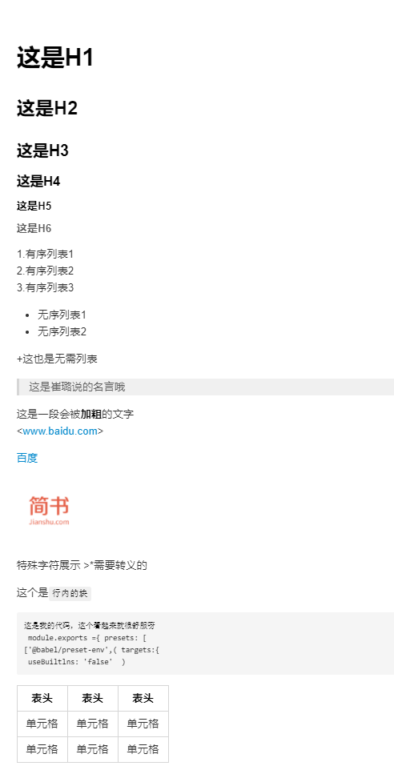

# 这是H1
## 这是H2
### 这是H3
#### 这是H4
##### 这是H5
###### 这是H6

1.有序列表1
2.有序列表2
3.有序列表3

- 无序列表1 
- 无序列表2

+ 这也是无需列表

>这是崔璐说的名言哦
这是一段会被**加粗**的文字
*斜体*

> 添加分割线
---
或者
***

  <www.baidu.com>

[百度](http://www.baidu.com)


特殊字符展示 \>\*需要转义的

这个是`行内的块`
\```
这是我的代码，这个看起来就很舒服呀
 module.exports ={ presets: [
['@babel/preset-env',( targets:{
 useBuiltlns: 'false'  )
\```

|  表头  |  表头  |  表头  |
|  ----  |  ----  |  ----  |
|  单元格  |  单元格  |  单元格  |
|  单元格  |  单元格  |  单元格  |

## 以下是规范
中英文之间需要增加空格 CCTV是央视频道。

中英文、数字之间需要增加空格-今年双十一我花费了1000元。

数字单位之间应该增加空格-这个硬盘是 10 TB。

不要重复使用标点符号-花费了1000元!

专有名词使用正确的大小写-请使用 WeChat登录。

全角和半角符号-中文段落中使用中文全角标点。/英文整句使用半角标点


###效果图


# Echo规范
- 这样破坏元素，自定义 <*tbody>
- 一级标题下面两个 ---
- 二级标题 一个---, 同一个一级标题，要么全加要么全不加
- 最多用到三级标题